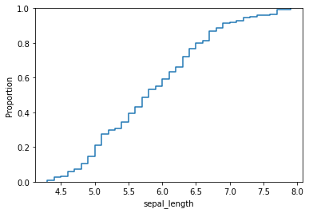
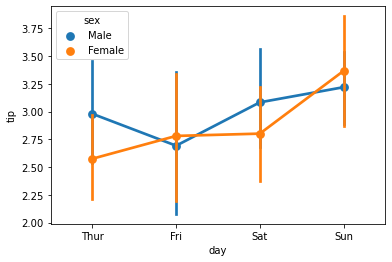
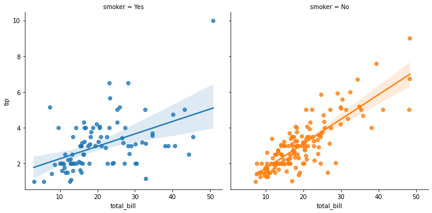

# Seaborn 시각화 튜토리얼

## 1. Seaborn
matplotlib 기반으로 만들어진 데이터 시각화 모듈  
다양한 색상과 예쁜 디자인, 다양한 통계 관련 그래프를 지원하며, matplotlib 보다 사용법이 쉽다는 장점을 가진다고 함
#### 지원하는 그래프  
[공식 홈페이지](https://seaborn.pydata.org/examples/index.html)에서 이미지로 확인 가능  
1. Relational: 두가지 변수의 관계를 나타내기 위한 그래프
   - scatterplot
   - lineplot
   - relplot
2. Distribution: 변수 하나 혹은 두개의 값 분포를 나타내기 위한 그래프
   - histplot
   - kdeplot
   - ecdfplot
   - rugplot
   - displot
3. Categorical: 범주형 변수와 연속형 변수간의 관계를 나타내기 위한 그래프
   - catplot
   - stripplot
   - boxplot
   - violinplot
   - pointplot
   - barplot
4. Regression: 회귀 분석 결과를 나타내기 위한 그래프
   - regplot
   - lmplot
   - residplot
5. Matrix: 연속형 변수간의 관계 비율을 시각화하기 위한 그래프
   - heatmap
   - clustermap
6. Multi-plot: 여러 그래프를 함께 그려 비교하기 위한 그래프
   - FacetGrid
   - pairplot
   - PairGrid
   - jointplot
   - JointGrid

## 2. 모듈 및 데이터 셋
### 모듈


```python
import pandas as pd
import numpy as np
import matplotlib.pyplot as plt
import seaborn as sns
```

### 데이터 셋


```python
# 붓꽃 데이터 셋
iris = sns.load_dataset("iris")
print(iris)
```

         sepal_length  sepal_width  petal_length  petal_width    species
    0             5.1          3.5           1.4          0.2     setosa
    1             4.9          3.0           1.4          0.2     setosa
    2             4.7          3.2           1.3          0.2     setosa
    3             4.6          3.1           1.5          0.2     setosa
    4             5.0          3.6           1.4          0.2     setosa
    ..            ...          ...           ...          ...        ...
    145           6.7          3.0           5.2          2.3  virginica
    146           6.3          2.5           5.0          1.9  virginica
    147           6.5          3.0           5.2          2.0  virginica
    148           6.2          3.4           5.4          2.3  virginica
    149           5.9          3.0           5.1          1.8  virginica
    
    [150 rows x 5 columns]
    


```python
# 타이타닉 데이터 셋
titanic = sns.load_dataset("titanic")
titanic
```


<div>
<style scoped>
    .dataframe tbody tr th:only-of-type {
        vertical-align: middle;
    }

    .dataframe tbody tr th {
        vertical-align: top;
    }

    .dataframe thead th {
        text-align: right;
    }
</style>
<table border="1" class="dataframe">
  <thead>
    <tr style="text-align: right;">
      <th></th>
      <th>survived</th>
      <th>pclass</th>
      <th>sex</th>
      <th>age</th>
      <th>sibsp</th>
      <th>parch</th>
      <th>fare</th>
      <th>embarked</th>
      <th>class</th>
      <th>who</th>
      <th>adult_male</th>
      <th>deck</th>
      <th>embark_town</th>
      <th>alive</th>
      <th>alone</th>
    </tr>
  </thead>
  <tbody>
    <tr>
      <th>0</th>
      <td>0</td>
      <td>3</td>
      <td>male</td>
      <td>22.0</td>
      <td>1</td>
      <td>0</td>
      <td>7.2500</td>
      <td>S</td>
      <td>Third</td>
      <td>man</td>
      <td>True</td>
      <td>NaN</td>
      <td>Southampton</td>
      <td>no</td>
      <td>False</td>
    </tr>
    <tr>
      <th>1</th>
      <td>1</td>
      <td>1</td>
      <td>female</td>
      <td>38.0</td>
      <td>1</td>
      <td>0</td>
      <td>71.2833</td>
      <td>C</td>
      <td>First</td>
      <td>woman</td>
      <td>False</td>
      <td>C</td>
      <td>Cherbourg</td>
      <td>yes</td>
      <td>False</td>
    </tr>
    <tr>
      <th>2</th>
      <td>1</td>
      <td>3</td>
      <td>female</td>
      <td>26.0</td>
      <td>0</td>
      <td>0</td>
      <td>7.9250</td>
      <td>S</td>
      <td>Third</td>
      <td>woman</td>
      <td>False</td>
      <td>NaN</td>
      <td>Southampton</td>
      <td>yes</td>
      <td>True</td>
    </tr>
    <tr>
      <th>3</th>
      <td>1</td>
      <td>1</td>
      <td>female</td>
      <td>35.0</td>
      <td>1</td>
      <td>0</td>
      <td>53.1000</td>
      <td>S</td>
      <td>First</td>
      <td>woman</td>
      <td>False</td>
      <td>C</td>
      <td>Southampton</td>
      <td>yes</td>
      <td>False</td>
    </tr>
    <tr>
      <th>4</th>
      <td>0</td>
      <td>3</td>
      <td>male</td>
      <td>35.0</td>
      <td>0</td>
      <td>0</td>
      <td>8.0500</td>
      <td>S</td>
      <td>Third</td>
      <td>man</td>
      <td>True</td>
      <td>NaN</td>
      <td>Southampton</td>
      <td>no</td>
      <td>True</td>
    </tr>
    <tr>
      <th>...</th>
      <td>...</td>
      <td>...</td>
      <td>...</td>
      <td>...</td>
      <td>...</td>
      <td>...</td>
      <td>...</td>
      <td>...</td>
      <td>...</td>
      <td>...</td>
      <td>...</td>
      <td>...</td>
      <td>...</td>
      <td>...</td>
      <td>...</td>
    </tr>
    <tr>
      <th>886</th>
      <td>0</td>
      <td>2</td>
      <td>male</td>
      <td>27.0</td>
      <td>0</td>
      <td>0</td>
      <td>13.0000</td>
      <td>S</td>
      <td>Second</td>
      <td>man</td>
      <td>True</td>
      <td>NaN</td>
      <td>Southampton</td>
      <td>no</td>
      <td>True</td>
    </tr>
    <tr>
      <th>887</th>
      <td>1</td>
      <td>1</td>
      <td>female</td>
      <td>19.0</td>
      <td>0</td>
      <td>0</td>
      <td>30.0000</td>
      <td>S</td>
      <td>First</td>
      <td>woman</td>
      <td>False</td>
      <td>B</td>
      <td>Southampton</td>
      <td>yes</td>
      <td>True</td>
    </tr>
    <tr>
      <th>888</th>
      <td>0</td>
      <td>3</td>
      <td>female</td>
      <td>NaN</td>
      <td>1</td>
      <td>2</td>
      <td>23.4500</td>
      <td>S</td>
      <td>Third</td>
      <td>woman</td>
      <td>False</td>
      <td>NaN</td>
      <td>Southampton</td>
      <td>no</td>
      <td>False</td>
    </tr>
    <tr>
      <th>889</th>
      <td>1</td>
      <td>1</td>
      <td>male</td>
      <td>26.0</td>
      <td>0</td>
      <td>0</td>
      <td>30.0000</td>
      <td>C</td>
      <td>First</td>
      <td>man</td>
      <td>True</td>
      <td>C</td>
      <td>Cherbourg</td>
      <td>yes</td>
      <td>True</td>
    </tr>
    <tr>
      <th>890</th>
      <td>0</td>
      <td>3</td>
      <td>male</td>
      <td>32.0</td>
      <td>0</td>
      <td>0</td>
      <td>7.7500</td>
      <td>Q</td>
      <td>Third</td>
      <td>man</td>
      <td>True</td>
      <td>NaN</td>
      <td>Queenstown</td>
      <td>no</td>
      <td>True</td>
    </tr>
  </tbody>
</table>
<p>891 rows × 15 columns</p>
</div>


```python
# 팁 데이터 셋
tips = sns.load_dataset("tips")
tips
```


<div>
<style scoped>
    .dataframe tbody tr th:only-of-type {
        vertical-align: middle;
    }

    .dataframe tbody tr th {
        vertical-align: top;
    }

    .dataframe thead th {
        text-align: right;
    }
</style>
<table border="1" class="dataframe">
  <thead>
    <tr style="text-align: right;">
      <th></th>
      <th>total_bill</th>
      <th>tip</th>
      <th>sex</th>
      <th>smoker</th>
      <th>day</th>
      <th>time</th>
      <th>size</th>
    </tr>
  </thead>
  <tbody>
    <tr>
      <th>0</th>
      <td>16.99</td>
      <td>1.01</td>
      <td>Female</td>
      <td>No</td>
      <td>Sun</td>
      <td>Dinner</td>
      <td>2</td>
    </tr>
    <tr>
      <th>1</th>
      <td>10.34</td>
      <td>1.66</td>
      <td>Male</td>
      <td>No</td>
      <td>Sun</td>
      <td>Dinner</td>
      <td>3</td>
    </tr>
    <tr>
      <th>2</th>
      <td>21.01</td>
      <td>3.50</td>
      <td>Male</td>
      <td>No</td>
      <td>Sun</td>
      <td>Dinner</td>
      <td>3</td>
    </tr>
    <tr>
      <th>3</th>
      <td>23.68</td>
      <td>3.31</td>
      <td>Male</td>
      <td>No</td>
      <td>Sun</td>
      <td>Dinner</td>
      <td>2</td>
    </tr>
    <tr>
      <th>4</th>
      <td>24.59</td>
      <td>3.61</td>
      <td>Female</td>
      <td>No</td>
      <td>Sun</td>
      <td>Dinner</td>
      <td>4</td>
    </tr>
    <tr>
      <th>...</th>
      <td>...</td>
      <td>...</td>
      <td>...</td>
      <td>...</td>
      <td>...</td>
      <td>...</td>
      <td>...</td>
    </tr>
    <tr>
      <th>239</th>
      <td>29.03</td>
      <td>5.92</td>
      <td>Male</td>
      <td>No</td>
      <td>Sat</td>
      <td>Dinner</td>
      <td>3</td>
    </tr>
    <tr>
      <th>240</th>
      <td>27.18</td>
      <td>2.00</td>
      <td>Female</td>
      <td>Yes</td>
      <td>Sat</td>
      <td>Dinner</td>
      <td>2</td>
    </tr>
    <tr>
      <th>241</th>
      <td>22.67</td>
      <td>2.00</td>
      <td>Male</td>
      <td>Yes</td>
      <td>Sat</td>
      <td>Dinner</td>
      <td>2</td>
    </tr>
    <tr>
      <th>242</th>
      <td>17.82</td>
      <td>1.75</td>
      <td>Male</td>
      <td>No</td>
      <td>Sat</td>
      <td>Dinner</td>
      <td>2</td>
    </tr>
    <tr>
      <th>243</th>
      <td>18.78</td>
      <td>3.00</td>
      <td>Female</td>
      <td>No</td>
      <td>Thur</td>
      <td>Dinner</td>
      <td>2</td>
    </tr>
  </tbody>
</table>
<p>244 rows × 7 columns</p>
</div>


```python
# mri 데이터 셋
fmri = sns.load_dataset("fmri")
fmri
```


<div>
<style scoped>
    .dataframe tbody tr th:only-of-type {
        vertical-align: middle;
    }

    .dataframe tbody tr th {
        vertical-align: top;
    }

    .dataframe thead th {
        text-align: right;
    }
</style>
<table border="1" class="dataframe">
  <thead>
    <tr style="text-align: right;">
      <th></th>
      <th>subject</th>
      <th>timepoint</th>
      <th>event</th>
      <th>region</th>
      <th>signal</th>
    </tr>
  </thead>
  <tbody>
    <tr>
      <th>0</th>
      <td>s13</td>
      <td>18</td>
      <td>stim</td>
      <td>parietal</td>
      <td>-0.017552</td>
    </tr>
    <tr>
      <th>1</th>
      <td>s5</td>
      <td>14</td>
      <td>stim</td>
      <td>parietal</td>
      <td>-0.080883</td>
    </tr>
    <tr>
      <th>2</th>
      <td>s12</td>
      <td>18</td>
      <td>stim</td>
      <td>parietal</td>
      <td>-0.081033</td>
    </tr>
    <tr>
      <th>3</th>
      <td>s11</td>
      <td>18</td>
      <td>stim</td>
      <td>parietal</td>
      <td>-0.046134</td>
    </tr>
    <tr>
      <th>4</th>
      <td>s10</td>
      <td>18</td>
      <td>stim</td>
      <td>parietal</td>
      <td>-0.037970</td>
    </tr>
    <tr>
      <th>...</th>
      <td>...</td>
      <td>...</td>
      <td>...</td>
      <td>...</td>
      <td>...</td>
    </tr>
    <tr>
      <th>1059</th>
      <td>s0</td>
      <td>8</td>
      <td>cue</td>
      <td>frontal</td>
      <td>0.018165</td>
    </tr>
    <tr>
      <th>1060</th>
      <td>s13</td>
      <td>7</td>
      <td>cue</td>
      <td>frontal</td>
      <td>-0.029130</td>
    </tr>
    <tr>
      <th>1061</th>
      <td>s12</td>
      <td>7</td>
      <td>cue</td>
      <td>frontal</td>
      <td>-0.004939</td>
    </tr>
    <tr>
      <th>1062</th>
      <td>s11</td>
      <td>7</td>
      <td>cue</td>
      <td>frontal</td>
      <td>-0.025367</td>
    </tr>
    <tr>
      <th>1063</th>
      <td>s0</td>
      <td>0</td>
      <td>cue</td>
      <td>parietal</td>
      <td>-0.006899</td>
    </tr>
  </tbody>
</table>
<p>1064 rows × 5 columns</p>
</div>


## 그래프 정리
[참고](https://seaborn.pydata.org/api.html)

### 1. Relational: 두가지 변수의 관계를 나타내기 위한 그래프
- scatterplot: 산점도
- lineplot: 라인
- relplot: scatterplot과 lineplot을 합친 그래프

#### scatterplot
`scatter(x, y, data)`


```python
sns.scatterplot(x='total_bill', y='tip', data=tips)
```


    <AxesSubplot:xlabel='total_bill', ylabel='tip'>


    

    


hue와 stlye 옵션을 줄 수 있음  
- hue: 의미에 따라 점의 색을 변경
- style: 모양 구분


```python
sns.scatterplot(x='total_bill', y='tip', data=tips, hue='day', style='time')
```


    <AxesSubplot:xlabel='total_bill', ylabel='tip'>


    

    


#### lineplot
데이터가 연속적일 경우 주로 사용


```python
sns.lineplot(x='timepoint', y='signal', data=fmri)
```


    <AxesSubplot:xlabel='timepoint', ylabel='signal'>


    

    


- 색이 칠해져 있는 부분은 신뢰구간(confidene interval)로 `ci` 파라미터로 조절 가능  
- `hue`와 `style` 옵션을 사용할 수 있음


```python
sns.lineplot(x='timepoint', y='signal', data=fmri, hue='event', style='event', ci=None)
```


    <AxesSubplot:xlabel='timepoint', ylabel='signal'>


    

    


#### relplot
- `kind` 파라미터에 `scatter`나 `line`으로 형식 선택 가능 (`default=scatter`)  
- scatterplot과 lineplot은 `AxeSubplot`을 반환하지만, relplot은 `FaceGrid`를 반환  
- `FaceGrid`를 반환하는 경우 여러 그래프를 한 번에 그릴수 있음
- `hue`와 `style` 옵션 모두 사용 가능


```python
sns.relplot(x='total_bill', y='tip', kind='scatter', hue='time', data=tips)
```


    <seaborn.axisgrid.FacetGrid at 0x2841a3b09d0>


    

    


### 2. Distribution: 변수 하나 혹은 두개의 값 분포를 나타내기 위한 그래프
- histplot
- kdeplot
- ecdfplot
- rugplot
- distplot -> 삭제 예정
- displot -> Distribution 함수들의 통합 개념

#### histplot
히스토그램 그래프를 그리는 함수로, 데이터의 빈도를 나타낼 때 사용


```python
sns.histplot(data=iris, x='sepal_length')
```


    <AxesSubplot:xlabel='sepal_length', ylabel='Count'>


    

    


- `hue` 옵션으로 레이블 구분
- `multiple` 옵션으로 `hue`로 분류된 레이블을 중첩되게 설정 가능


```python
sns.histplot(data=iris, x='sepal_length', hue='species')
```


    <AxesSubplot:xlabel='sepal_length', ylabel='Count'>


    

    


```python
sns.histplot(data=iris, x='sepal_length', hue='species', multiple='stack')
```


    <AxesSubplot:xlabel='sepal_length', ylabel='Count'>


    

    


2차원으로도 그릴수 있는데, count 정보는 나타나지 않음 -> `multiple` 옵션을 줘도 달라지는게 없음


```python
sns.histplot(data=iris, x='sepal_length', y='sepal_width', hue='species')
```


    <AxesSubplot:xlabel='sepal_length', ylabel='sepal_width'>


    

    


```python
sns.histplot(data=iris, x='sepal_length', y='sepal_width', hue='species', multiple='stack')
```


    <AxesSubplot:xlabel='sepal_length', ylabel='sepal_width'>


    

    


#### kdeplot
커널 밀도 추정(kernal density estimation) 그래프로,  
히스토그램이 절대량(count)을 표현한다면 kdeplotdms 상대량(비율)을 시각화  
히스토그램과 마찬가지로 한개 혹은 두개의 변수에 대한 분포를 그릴 수 있음


```python
sns.kdeplot(data=iris, x='sepal_length')
```


    <AxesSubplot:xlabel='sepal_length', ylabel='Density'>


    

    


`hue` 옵션 사용 가능


```python
sns.kdeplot(data=iris, x='sepal_length', hue='species')
```


    <AxesSubplot:xlabel='sepal_length', ylabel='Density'>


    

    


```python
sns.kdeplot(data=iris, x='sepal_length', y='sepal_width', hue='species')
```


    <AxesSubplot:xlabel='sepal_length', ylabel='sepal_width'>


    

    


```python
# histplot과 kedplot을 함께 사용하는 경우
sns.histplot(data=iris, x='sepal_length', hue='species', multiple='stack', kde=True)
```


    <AxesSubplot:xlabel='sepal_length', ylabel='Count'>


    

    


#### rugplot
데이터 값을 x축과 y축 위에 그려주는 그래프 -> 단독으로 사용되기보다는 다른 그래프와 함께 사용된다(i.e. kdeplot)  
다른 그래프를 보완해주는 느낌


```python
sns.kdeplot(data=iris, x='sepal_length', y='sepal_width', hue='species') 
```


    <AxesSubplot:xlabel='sepal_length', ylabel='sepal_width'>


    

    


```python
sns.rugplot(data=iris, x='sepal_length', y='sepal_width', hue='species')
```


    <AxesSubplot:xlabel='sepal_length', ylabel='sepal_width'>


    

    


```python
sns.kdeplot(data=iris, x='sepal_length', y='sepal_width', hue='species') 
sns.rugplot(data=iris, x='sepal_length', y='sepal_width', hue='species')

```


    <AxesSubplot:xlabel='sepal_length', ylabel='sepal_width'>


    

    


#### ecdfplot
분포를 누적화해 보여줌


```python
sns.ecdfplot(data=iris, x='sepal_length')
```


    <AxesSubplot:xlabel='sepal_length', ylabel='Proportion'>


    

    


#### displot
- 앞선 함수들의 통합 개념들로, relplot과 유사함  
- `row`와 `col` 파라미터로 subplot 생성 가능
- `rug` 옵션으로 `rugplot`의 표시 여부를 선택 가능


```python
sns.displot(data=iris, x='sepal_length', hue='species') # kind default = hist
```


    <seaborn.axisgrid.FacetGrid at 0x2841cc68e50>


    

    


```python
sns.displot(data=iris, x='sepal_length', hue='species', col='species')
```


    <seaborn.axisgrid.FacetGrid at 0x2841c8678e0>


    

    


```python
sns.displot(data=iris, kind='kde', x='sepal_length', hue='species', row='species', rug=True)
```


    <seaborn.axisgrid.FacetGrid at 0x2841c72f490>


    

    


### 3. Categorical: 범주형 변수와 연속형 변수간의 관계를 나타내기 위한 그래프
- catplot
- stripplot
- boxplot
- violinplot
- pointplot
- barplot

#### barplot
- 이변량(bivariate) 분석을 위한 그래프
- x축에는 범주형 변수, y축에는 연속형 변수를 입력
- x와 y의 형을 바꾸면 수평 그래프가 출력


```python
sns.barplot(data=tips, x='day', y='tip')
```


    <AxesSubplot:xlabel='day', ylabel='tip'>


    

    


```python
sns.barplot(data=tips, x='day', y='tip', hue='smoker')
```


    <AxesSubplot:xlabel='day', ylabel='tip'>


    

    


검은 막대는 오차를 의미하며, `ci` 옵션으로 설정 가능함  
#### ci
- 숫자: 신뢰 구간(%)
- sd: 표준 편차
- None: 표현하지 않음


```python
sns.barplot(data=tips, x='tip', y='day', ci='sd')
```


    <AxesSubplot:xlabel='tip', ylabel='day'>


    

    


#### countplot
- histplot과 동일하게 데이터의 갯수를 출력 (histplot은 연속형 데이터, countplot은 범주형 데이터)
- x와 y의 데이터를 통해 수직, 수평을 조절 가능


```python
sns.countplot(data=tips, x='smoker', hue='sex')
```


    <AxesSubplot:xlabel='smoker', ylabel='count'>


    

    


#### boxplot
특정 데이터의 전체적인 분포를 확인하기 좋은 그래프
- 변수 1개인 경우, 연속형 변수 사용
- 변수 2개인 경우, 연속형 변수와 범주형 변수 사용
- 통계치(최대/최소/사분위수(1,3)/평균)를 함께 표시
- 특이치(outliar)를 발견하기에 용이


```python
sns.boxplot(data=tips, x='tip')
```


    <AxesSubplot:xlabel='tip'>


    

    


```python
sns.boxplot(data=tips, x='day', y='total_bill')
```


    <AxesSubplot:xlabel='day', ylabel='total_bill'>


    

    


#### violinplot
- boxplot은 이상치를 한번에 파악할 수 있고, violinplot은 데이터 분포를 한번에 파악할 수 있음
- 분포에 따라 모양이 달라짐


```python
sns.violinplot(data=tips, x='day', y='total_bill')
```


    <AxesSubplot:xlabel='day', ylabel='total_bill'>


    

    


#### stripplot
- 연속형 변수와 범주형 변수의 관계를 나타내는 산점도
- scatterplot은 연속형과 연속형의 관계를 나타냄
- x, y의 데이터 형에 따라 수직, 수평이 달라짐


```python
sns.stripplot(data=tips, x='day', y='total_bill')
```


    <AxesSubplot:xlabel='day', ylabel='total_bill'>


    

    


#### swarmplot
- stripplot과 유사
- 분포 정도를 함께 표현
- violinplot과 함께 쓰이는 경우가 많음 -> violinplot이 세부적인 데이터 분포를 보여주지 못한다는 점을 보완


```python
sns.swarmplot(data=tips, x='day', y='total_bill')
```


    <AxesSubplot:xlabel='day', ylabel='total_bill'>


    

    


```python
sns.violinplot(data=tips, x='day', y='total_bill')
sns.swarmplot(data=tips, x='day', y='total_bill', color='white')
```


    <AxesSubplot:xlabel='day', ylabel='total_bill'>


    

    


#### boxenplot
- boxplot과 유사
- 데이터 분포가 박스의 크기로 나타남


```python
sns.boxenplot(data=tips, x='day', y='total_bill')
```


    <AxesSubplot:xlabel='day', ylabel='total_bill'>


    

    


#### pointplot
- 연속형 변수와 범주형 변수의 관계를 나타내는 그래프
- 오차바(error bar)도 함께 표시 됨


```python
sns.pointplot(data=tips, x='day', y='tip', hue='sex')
```


    <AxesSubplot:xlabel='day', ylabel='tip'>


    

    


#### catplot
- 앞선 함수들의 통합 개념들로, relplot, displot 과 유사함  
- `row`와 `col` 파라미터로 subplot 생성 가능


```python
sns.catplot(data=tips, x='day', y='total_bill', col='sex', kind='bar')
```


    <seaborn.axisgrid.FacetGrid at 0x2841d101ca0>


    

    


### 4. Regression: 회귀 분석 결과를 나타내기 위한 그래프
- regplot
- lmplot
- residplot

#### regplot
- scatterplot과 lineplot을 합쳐 놓은 그래프
- scatterplot의 경향성을 lineplot이 예측하는 방향으로 그려짐


```python
sns.regplot(data=tips, x='total_bill', y='tip')
```


    <AxesSubplot:xlabel='total_bill', ylabel='tip'>


    

    


#### lmplot
- regplot의 상위 그래프
- 여러개의 그래프를 그릴 수 있으며, `hue` 옵션 사용 가능
- regplot 보다 많이 사용된다고 함


```python
sns.lmplot(data=tips, x='total_bill', y='tip', hue='smoker')
```


    <seaborn.axisgrid.FacetGrid at 0x2841e9e3e50>


    

    


`col`과 `row` 옵션을 이용해 그래프를 분리 가능


```python
sns.lmplot(data=tips, x='total_bill', y='tip', hue='smoker', col='smoker')
```


    <seaborn.axisgrid.FacetGrid at 0x2841ea35610>


    

    


#### residplot
- 회귀선을 기준으로 오차를 나타낸 그래프
- regplot의 회귀선이 x축가 평행하게 나타남


```python
sns.residplot(data=tips, x='total_bill', y='tip')
```


    <AxesSubplot:xlabel='total_bill', ylabel='tip'>


    

    


### 5. Matrix: 연속형 변수간의 관계 비율을 시각화하기 위한 그래프
- heatmap
- clustermap

#### heatmap
- 데이터의 상관관계 정도에 따라 색차이를 부여한 그래프
- pivot-table과 correlation 개념이 적용되어 있음


```python
# pivot-table
tips.pivot_table(index='day', columns='size', values='tip')
```


<div>
<style scoped>
    .dataframe tbody tr th:only-of-type {
        vertical-align: middle;
    }

    .dataframe tbody tr th {
        vertical-align: top;
    }

    .dataframe thead th {
        text-align: right;
    }
</style>
<table border="1" class="dataframe">
  <thead>
    <tr style="text-align: right;">
      <th>size</th>
      <th>1</th>
      <th>2</th>
      <th>3</th>
      <th>4</th>
      <th>5</th>
      <th>6</th>
    </tr>
    <tr>
      <th>day</th>
      <th></th>
      <th></th>
      <th></th>
      <th></th>
      <th></th>
      <th></th>
    </tr>
  </thead>
  <tbody>
    <tr>
      <th>Thur</th>
      <td>1.83</td>
      <td>2.442500</td>
      <td>2.692500</td>
      <td>4.218000</td>
      <td>5.000000</td>
      <td>5.3</td>
    </tr>
    <tr>
      <th>Fri</th>
      <td>1.92</td>
      <td>2.644375</td>
      <td>3.000000</td>
      <td>4.730000</td>
      <td>NaN</td>
      <td>NaN</td>
    </tr>
    <tr>
      <th>Sat</th>
      <td>1.00</td>
      <td>2.517547</td>
      <td>3.797778</td>
      <td>4.123846</td>
      <td>3.000000</td>
      <td>NaN</td>
    </tr>
    <tr>
      <th>Sun</th>
      <td>NaN</td>
      <td>2.816923</td>
      <td>3.120667</td>
      <td>4.087778</td>
      <td>4.046667</td>
      <td>5.0</td>
    </tr>
  </tbody>
</table>
</div>


```python
sns.heatmap(tips.pivot_table(index='day', columns='size', values='tip'), annot=True)
```


    <AxesSubplot:xlabel='size', ylabel='day'>


    

    


```python
sns.heatmap(iris.corr(), annot=True)
```


    <AxesSubplot:>


    

    


#### clustermap
- heatmap과 유사하나 잘 사용되지 않음


```python
sns.clustermap(iris)
```


    <seaborn.matrix.ClusterGrid at 0x28420112220>


    

    


### 6. Multi-plot: 여러 그래프를 함께 그려 비교하기 위한 그래프
주로 반환형으로 사용되는거 같아서 따로 정리하지는 않았음  
- FacetGrid
- pairplot
- PairGrid
- jointplot
- JointGrid
