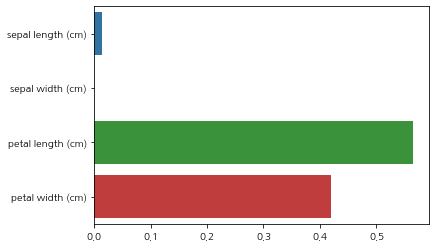
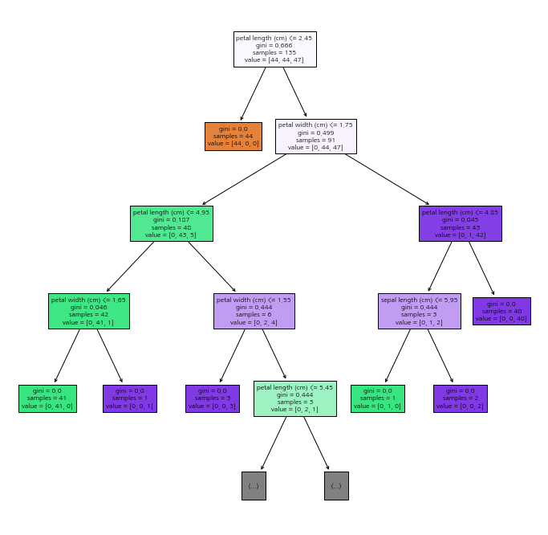

# Iris
## Classification - Decision Tree
### 사용 라이브러리


```python
import numpy as np
import pandas as pd
import seaborn as sns
import matplotlib.pyplot as plt
import koreanize_matplotlib
from sklearn.datasets import load_iris
from sklearn.tree import DecisionTreeClassifier, plot_tree
from sklearn.model_selection import train_test_split
from sklearn.metrics import accuracy_score
```

### Data Load


```python
iris = load_iris()
iris_data = iris.data # feature만으로 된 데이터
iris_label = iris.target # label 데이터

df_iris = pd.DataFrame(data=iris_data, columns=iris.feature_names)
df_iris["label"] = iris.target
df_iris.sample(5)
```


<div>
<style scoped>
    .dataframe tbody tr th:only-of-type {
        vertical-align: middle;
    }

    .dataframe tbody tr th {
        vertical-align: top;
    }

    .dataframe thead th {
        text-align: right;
    }
</style>
<table border="1" class="dataframe">
  <thead>
    <tr style="text-align: right;">
      <th></th>
      <th>sepal length (cm)</th>
      <th>sepal width (cm)</th>
      <th>petal length (cm)</th>
      <th>petal width (cm)</th>
      <th>label</th>
    </tr>
  </thead>
  <tbody>
    <tr>
      <th>29</th>
      <td>4.7</td>
      <td>3.2</td>
      <td>1.6</td>
      <td>0.2</td>
      <td>0</td>
    </tr>
    <tr>
      <th>89</th>
      <td>5.5</td>
      <td>2.5</td>
      <td>4.0</td>
      <td>1.3</td>
      <td>1</td>
    </tr>
    <tr>
      <th>37</th>
      <td>4.9</td>
      <td>3.6</td>
      <td>1.4</td>
      <td>0.1</td>
      <td>0</td>
    </tr>
    <tr>
      <th>45</th>
      <td>4.8</td>
      <td>3.0</td>
      <td>1.4</td>
      <td>0.3</td>
      <td>0</td>
    </tr>
    <tr>
      <th>140</th>
      <td>6.7</td>
      <td>3.1</td>
      <td>5.6</td>
      <td>2.4</td>
      <td>2</td>
    </tr>
  </tbody>
</table>
</div>


### 학습


```python
X_train, X_test, y_train, y_test = train_test_split(iris_data, iris_label, test_size=0.1, random_state=42)
```


```python
dt_clf = DecisionTreeClassifier(random_state=42)
dt_clf
```


    DecisionTreeClassifier(random_state=42)


```python
dt_clf.fit(X_train, y_train)
```


    DecisionTreeClassifier(random_state=42)


```python
y_predict = dt_clf.predict(X_test)
```


```python
accuracy_score(y_test, y_predict)
```


    1.0


데이터 셋의 크기가 작은것이 성능에 영향을 많이 준듯..

### 모델 분석


```python
features_names = df_iris.columns.tolist()
features_names.remove("label")
features_names
```


    ['sepal length (cm)',
     'sepal width (cm)',
     'petal length (cm)',
     'petal width (cm)']


```python
_ = sns.barplot(x=dt_clf.feature_importances_, y=features_names)
```


    

    


```python
plt.figure(figsize=(12, 12))
pt = plot_tree(dt_clf, filled=True, fontsize=8, feature_names=features_names, max_depth=4)
plt.show()
```


    

    

