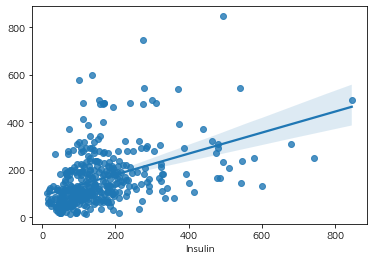
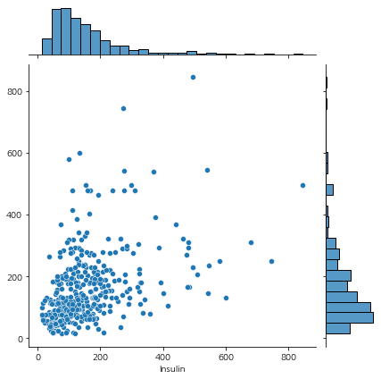
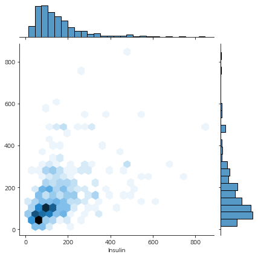
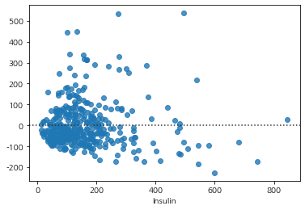
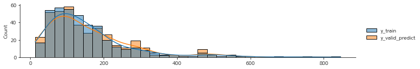
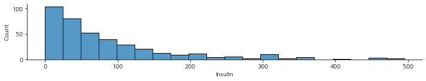
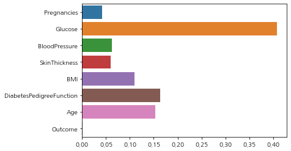

# Pima Indians Diabetes Regression
`sklearn` 결정 트리를 이용한 회귀
## 데이터 셋 출처
[Pima Indians Diabetes Database | Kaggle](https://www.kaggle.com/uciml/pima-indians-diabetes-database)  
[sklearn](https://scikit-learn.org/stable/modules/generated/sklearn.datasets.load_diabetes.html)
### 사용 라이브러리


```python
import numpy as np
import pandas as pd
import seaborn as sns
import matplotlib.pyplot as plt
import koreanize_matplotlib
from sklearn.model_selection import train_test_split
from sklearn.tree import plot_tree
from sklearn.metrics import accuracy_score
```

--- 
### Data Load


```python
df_pima = pd.read_csv("http://bit.ly/data-diabetes-csv")
df_pima.shape
```


    (768, 9)


### 기본적인 학습
회귀에 대한 내용이므로, 결측치가 많았던 `Insulin`을 타겟으로 지정해 사용


```python
_ = sns.kdeplot(data=df_pima, x="Insulin", hue="Outcome")
```


    

    


#### 데이터 셋 나누기


```python
label_name = "Insulin"
```


```python
feature_names = df_pima.columns.tolist()
feature_names.remove(label_name)
feature_names
```


    ['Pregnancies',
     'Glucose',
     'BloodPressure',
     'SkinThickness',
     'BMI',
     'DiabetesPedigreeFunction',
     'Age',
     'Outcome']


`Insulin`을 예측하는 모델을 만들 예정이므로, Train 세트에는 `Insulin`의 값이 존재하는 데이터만 사용할 수 있음


```python
train = df_pima[df_pima["Insulin"]>0]
test = df_pima[df_pima["Insulin"]==0]
print(f"train: {train.shape}\n test: {test.shape}")
```

    train: (394, 9)
     test: (374, 9)
    


```python
X_train, y_train, X_test, y_test = train[feature_names], train[label_name], test[feature_names], test[label_name]
print(f"X_train: {X_train.shape}\ny_train: {y_train.shape}\nX_test: {X_test.shape}\ny_test: {y_test.shape}")
```

    X_train: (394, 8)
    y_train: (394,)
    X_test: (374, 8)
    y_test: (374,)
    

#### 회귀 알고리즘
결정 트리는 분류와 회귀에 모두 사용 가능한 `CART` 알고리즘이므로 결정 트리 기반의 회귀 모델을 사용함


```python
from sklearn.tree import DecisionTreeRegressor

model = DecisionTreeRegressor(random_state=42)
model.fit(X_train, y_train)
```


    DecisionTreeRegressor(random_state=42)


### Cross validation (교차 검증)
모델 학습 시 데이터를 훈련용(`train`)과 검증용(`valid`)으로 선택하는 방법  
모델 성능에 직접적인 영향은 없고, 평가의 정확도를 높이는 목적으로 사용  
가장 많이 사용하는 방식은 `K-Fold Cross Validation`임  

#### 교차 검증 종류
1. Hold-out Cross-Validation: 특정 비율로 Train과 Test를 **1회**만 분할
2. K-Fold Cross-Validation: 전체를 K개로 나누고, 1개를 Test로 나머지(K-1)개를 학습용으로 사용하는 과정을 K번 반복함
3. LpOCV (Leave-p-Out Cross-Validatoin): 전체 데이터 중에서 p개의 샘플을 선택해 모델 검증에 활용
4. LOOCV (Leave-One-Out CV): LpOCV에서 `p=1`인 경우

- 장점
  - Overfitting 방지
  - 일반화된 모델 생성 가능
  - 적은 데이터에서 Underfitting 방지
- 단점
  - 소요시간 증가


```python
from sklearn.model_selection import cross_val_predict
# cv: k-fold의 k, 5 -> 4개로 학습하고 1개로 검증
# n_jobs: 사용할 코어의 개수
# verbose: 로그를 얼마나 출력할 것인지
y_valid_predict = cross_val_predict(model, X_train, y_train, cv=5, n_jobs=-1, verbose=0)
```


```python
np.sum(y_train==y_valid_predict)
```


    3


```python
np.mean(y_train==y_valid_predict)
```


    0.007614213197969543


정답을 3개 밖에 맞추지 못했습니다..  정답률은 약 0.008%로 굉장히 낮습니다.

### 잔차(residual) 구하기
잔차를 시각화해봅니다


```python
_ = sns.regplot(x=y_train, y=y_valid_predict)
```


    

    


```python
_ = sns.jointplot(x=y_train, y=y_valid_predict)
```


    

    


```python
_ = sns.jointplot(x=y_train, y=y_valid_predict, kind="hex")
```


    

    


```python
_ = sns.residplot(x=y_train, y=y_valid_predict)
```


    

    


`residplot`에서, 0은 추정치와 실제값의 차이가 없는 것을 의미하므로 0에 가까울수록 잘 예측한 값임

### 회귀를 측정하는 방식
#### R2_score
R2 score는 회귀 모델이 얼마나 설명력이 있느냐를 의미하며, 실제값의 분산 대비 예측값의 분산 비율이라고 이해 가능함  
1에 가까울수록 좋은 성능을 가졌다고 해석할 수 있음 


```python
from sklearn.metrics import r2_score

r2_score(y_train, y_valid_predict)
```


    -0.14429295602725567


```python
df_y = pd.DataFrame({"y_train": y_train, "y_valid_predict": y_valid_predict})
df_y.head()
```


<div>
<style scoped>
    .dataframe tbody tr th:only-of-type {
        vertical-align: middle;
    }

    .dataframe tbody tr th {
        vertical-align: top;
    }

    .dataframe thead th {
        text-align: right;
    }
</style>
<table border="1" class="dataframe">
  <thead>
    <tr style="text-align: right;">
      <th></th>
      <th>y_train</th>
      <th>y_valid_predict</th>
    </tr>
  </thead>
  <tbody>
    <tr>
      <th>3</th>
      <td>94</td>
      <td>25.0</td>
    </tr>
    <tr>
      <th>4</th>
      <td>168</td>
      <td>480.0</td>
    </tr>
    <tr>
      <th>6</th>
      <td>88</td>
      <td>55.0</td>
    </tr>
    <tr>
      <th>8</th>
      <td>543</td>
      <td>145.0</td>
    </tr>
    <tr>
      <th>13</th>
      <td>846</td>
      <td>495.0</td>
    </tr>
  </tbody>
</table>
</div>


```python
# 정답값과 예측값의 분포
_ = sns.displot(df_y, height=2, aspect=5, kde=True)
```


    

    


#### 오차


```python
# 오차에서 부호에 의미를 부여 가능하지만, 큰 의미가 없으므로 절대값을 사용
error = y_train - y_valid_predict
abs(error).describe()
```


    count    394.000000
    mean      86.571066
    std       92.896321
    min        0.000000
    25%       22.250000
    50%       55.000000
    75%      115.000000
    max      495.000000
    Name: Insulin, dtype: float64


```python
# 오차값의 분포
_ = sns.displot(abs(error), height=2, aspect=5)
```


    

    


#### MAE(Mean Absolut Error)
평균 절대 오차라고하며, 평균 절대 편차/차이와는 다른 개념임  
$MAE = {\sum_{i=1}^n err_i \over n }$


```python
abs(error).mean()
```


    86.57106598984771


#### MAPE (Mean Absolute Percentage Error)
평균 절대비 오차라하며, 퍼센트 값을 가짐  
0에 가까울수록 회귀 모형의 성능이 좋다고 해석 가능  
평균 절대 백분율 편차 (MAPD)라고도 함  
$MAPE = {100\% \over n} \sum_{i=1}^n |{y_i-\hat y_i \over y_i}|$


```python
abs(error/y_train).mean()
```


    0.687125648313691


#### MSE (Mean Squared Error)
평균 제곱 오차라하며, 제곱을 이용해 음수를 양수로 변환  
$ MSE = {1 \over n} \sum_{i=1}^n (\hat y_i - y_i)^2 $


```python
np.square(error).mean()
```


    16102.373096446701


#### RMSE (Root Mean Squared Error)
평균 제곱근 편차라하며, 정밀도를 표현하는데 적합  
$ RMSE = \sqrt{MSE} $


```python
np.sqrt(np.square(error).mean())
```


    126.89512636995443


### 트리 알고리즘 분석


```python
model.feature_importances_
```


    array([4.20201517e-02, 4.08219914e-01, 6.24932543e-02, 5.97519119e-02,
           1.10296456e-01, 1.63917473e-01, 1.52984660e-01, 3.16179009e-04])


```python
_ = sns.barplot(x=model.feature_importances_, y=feature_names)
```


    

    


### 예측
회귀에서 사용한 `cross-validation`은 예측을 진행한것이 아니라, 모델 성능을 높이기 위해 진행한 과정임


```python
y_predict = model.predict(X_test)
```


```python
# 기존 Insulin 수치
train.groupby("Outcome")["Insulin"].describe()
```


<div>
<style scoped>
    .dataframe tbody tr th:only-of-type {
        vertical-align: middle;
    }

    .dataframe tbody tr th {
        vertical-align: top;
    }

    .dataframe thead th {
        text-align: right;
    }
</style>
<table border="1" class="dataframe">
  <thead>
    <tr style="text-align: right;">
      <th></th>
      <th>count</th>
      <th>mean</th>
      <th>std</th>
      <th>min</th>
      <th>25%</th>
      <th>50%</th>
      <th>75%</th>
      <th>max</th>
    </tr>
    <tr>
      <th>Outcome</th>
      <th></th>
      <th></th>
      <th></th>
      <th></th>
      <th></th>
      <th></th>
      <th></th>
      <th></th>
    </tr>
  </thead>
  <tbody>
    <tr>
      <th>0</th>
      <td>264.0</td>
      <td>130.287879</td>
      <td>102.482237</td>
      <td>15.0</td>
      <td>66.0</td>
      <td>102.5</td>
      <td>161.25</td>
      <td>744.0</td>
    </tr>
    <tr>
      <th>1</th>
      <td>130.0</td>
      <td>206.846154</td>
      <td>132.699898</td>
      <td>14.0</td>
      <td>127.5</td>
      <td>169.5</td>
      <td>239.25</td>
      <td>846.0</td>
    </tr>
  </tbody>
</table>
</div>


```python
# 예측한 값으로 Insulin 값을 채운 경우
test["Insulin"] = y_predict
test.groupby("Outcome")["Insulin"].describe()
```
    


<div>
<style scoped>
    .dataframe tbody tr th:only-of-type {
        vertical-align: middle;
    }

    .dataframe tbody tr th {
        vertical-align: top;
    }

    .dataframe thead th {
        text-align: right;
    }
</style>
<table border="1" class="dataframe">
  <thead>
    <tr style="text-align: right;">
      <th></th>
      <th>count</th>
      <th>mean</th>
      <th>std</th>
      <th>min</th>
      <th>25%</th>
      <th>50%</th>
      <th>75%</th>
      <th>max</th>
    </tr>
    <tr>
      <th>Outcome</th>
      <th></th>
      <th></th>
      <th></th>
      <th></th>
      <th></th>
      <th></th>
      <th></th>
      <th></th>
    </tr>
  </thead>
  <tbody>
    <tr>
      <th>0</th>
      <td>236.0</td>
      <td>133.161017</td>
      <td>102.224032</td>
      <td>15.0</td>
      <td>64.0</td>
      <td>99.5</td>
      <td>158.25</td>
      <td>600.0</td>
    </tr>
    <tr>
      <th>1</th>
      <td>138.0</td>
      <td>212.434783</td>
      <td>141.952236</td>
      <td>44.0</td>
      <td>115.0</td>
      <td>176.0</td>
      <td>267.00</td>
      <td>846.0</td>
    </tr>
  </tbody>
</table>
</div>


평균값만 봤을때는 큰차이가 없음
