# DACON 병원 개/폐업 분류 예측 경진대회
[DACON 병원 개/폐업 분류 예측 경진대회](https://dacon.io/competitions/official/9565/overview/description)

EDA를 좀 더 꼼꼼하고 자세하게 하자..   
`Catboost`를 사용해보는것도 괜찮았을꺼 같기도하고..

### 사용 라이브러리


```python
import numpy as np
import pandas as pd
import seaborn as sns
import matplotlib.pyplot as plt
import koreanize_matplotlib

from sklearn.model_selection import train_test_split
from sklearn.metrics import accuracy_score, precision_score, recall_score, confusion_matrix, f1_score, roc_auc_score, mean_squared_error, mean_absolute_error, r2_score
from sklearn.ensemble import RandomForestClassifier

from lightgbm import LGBMClassifier
import lightgbm as lgbm
from xgboost import XGBClassifier
import xgboost as xgb

import warnings
warnings.filterwarnings("ignore")
```


```python
def eval_CM(y_test, y_pred=None, show_cm=0):
    confusion = confusion_matrix(y_test, y_pred)
    acc = accuracy_score(y_test, y_pred)
    precision = precision_score(y_test, y_pred)
    recall = recall_score(y_test, y_pred)
    f1 = f1_score(y_test, y_pred)
    if show_cm:
        print(f"정확도: {acc:.4f}\n정밀도: {precision:.4f}\n재현율: {recall:.4f}\nF1: {f1:.4f}")
    else:
        print(confusion)
        print(f"정확도: {acc:.4f}\n정밀도: {precision:.4f}\n재현율: {recall:.4f}\nF1: {f1:.4f}")

def reg_score(y_true, y_pred):
    MSE = mean_squared_error(y_true, y_pred)
    RMSE = np.sqrt(mean_squared_error(y_true,y_pred))
    MAE = np.mean( np.abs((y_true - y_pred) / y_true) )
    NMAE = mean_absolute_error(y_true, y_pred)/ np.mean( np.abs(y_true) )
    MAPE = np.mean( np.abs((y_true - y_pred) / y_true) ) *100
    R2 = r2_score(y_true, y_pred)
    
    print(f"MSE: {np.round(MSE, 3)}\nRMSE: {np.round(RMSE, 3)}\nMAE: {np.round(MAE, 3)}\nNMAE: {np.round(NMAE, 3)}\nMAPE: {np.round(MAPE, 3)}\nR2: {np.round(R2, 3)}")
```

### Data Load


```python
import glob

path = glob.glob("data/*")
path
```


    ['data\\pre_test.csv',
     'data\\pre_train.csv',
     'data\\submission_sample.csv',
     'data\\test.csv',
     'data\\train.csv']


```python
train, test = pd.read_csv(path[4], encoding="cp949"), pd.read_csv(path[3], encoding="cp949")

train.shape, test.shape
```


    ((301, 58), (127, 58))


### EDA 및 전처리
#### 기본 정보


```python
display(train.head())
display(test.head())
```


<div>
<style scoped>
    .dataframe tbody tr th:only-of-type {
        vertical-align: middle;
    }

    .dataframe tbody tr th {
        vertical-align: top;
    }

    .dataframe thead th {
        text-align: right;
    }
</style>
<table border="1" class="dataframe">
  <thead>
    <tr style="text-align: right;">
      <th></th>
      <th>inst_id</th>
      <th>OC</th>
      <th>sido</th>
      <th>sgg</th>
      <th>openDate</th>
      <th>bedCount</th>
      <th>instkind</th>
      <th>revenue1</th>
      <th>salescost1</th>
      <th>sga1</th>
      <th>...</th>
      <th>debt2</th>
      <th>liquidLiabilities2</th>
      <th>shortLoan2</th>
      <th>NCLiabilities2</th>
      <th>longLoan2</th>
      <th>netAsset2</th>
      <th>surplus2</th>
      <th>employee1</th>
      <th>employee2</th>
      <th>ownerChange</th>
    </tr>
  </thead>
  <tbody>
    <tr>
      <th>0</th>
      <td>1</td>
      <td>open</td>
      <td>choongnam</td>
      <td>73</td>
      <td>20071228</td>
      <td>175.0</td>
      <td>nursing_hospital</td>
      <td>4.217530e+09</td>
      <td>0.0</td>
      <td>3.961135e+09</td>
      <td>...</td>
      <td>7.589937e+08</td>
      <td>2.228769e+08</td>
      <td>0.000000e+00</td>
      <td>5.361169e+08</td>
      <td>3.900000e+08</td>
      <td>2.619290e+09</td>
      <td>1.271224e+09</td>
      <td>62.0</td>
      <td>64.0</td>
      <td>same</td>
    </tr>
    <tr>
      <th>1</th>
      <td>3</td>
      <td>open</td>
      <td>gyeongnam</td>
      <td>32</td>
      <td>19970401</td>
      <td>410.0</td>
      <td>general_hospital</td>
      <td>NaN</td>
      <td>NaN</td>
      <td>NaN</td>
      <td>...</td>
      <td>NaN</td>
      <td>NaN</td>
      <td>NaN</td>
      <td>NaN</td>
      <td>NaN</td>
      <td>NaN</td>
      <td>NaN</td>
      <td>801.0</td>
      <td>813.0</td>
      <td>same</td>
    </tr>
    <tr>
      <th>2</th>
      <td>4</td>
      <td>open</td>
      <td>gyeonggi</td>
      <td>89</td>
      <td>20161228</td>
      <td>468.0</td>
      <td>nursing_hospital</td>
      <td>1.004522e+09</td>
      <td>515483669.0</td>
      <td>4.472197e+08</td>
      <td>...</td>
      <td>0.000000e+00</td>
      <td>0.000000e+00</td>
      <td>0.000000e+00</td>
      <td>0.000000e+00</td>
      <td>0.000000e+00</td>
      <td>0.000000e+00</td>
      <td>0.000000e+00</td>
      <td>234.0</td>
      <td>1.0</td>
      <td>same</td>
    </tr>
    <tr>
      <th>3</th>
      <td>7</td>
      <td>open</td>
      <td>incheon</td>
      <td>141</td>
      <td>20000814</td>
      <td>353.0</td>
      <td>general_hospital</td>
      <td>7.250734e+10</td>
      <td>0.0</td>
      <td>7.067740e+10</td>
      <td>...</td>
      <td>3.775501e+10</td>
      <td>1.701860e+10</td>
      <td>9.219427e+09</td>
      <td>2.073641e+10</td>
      <td>1.510000e+10</td>
      <td>1.295427e+10</td>
      <td>7.740829e+09</td>
      <td>663.0</td>
      <td>663.0</td>
      <td>same</td>
    </tr>
    <tr>
      <th>4</th>
      <td>9</td>
      <td>open</td>
      <td>gyeongnam</td>
      <td>32</td>
      <td>20050901</td>
      <td>196.0</td>
      <td>general_hospital</td>
      <td>4.904354e+10</td>
      <td>0.0</td>
      <td>4.765605e+10</td>
      <td>...</td>
      <td>5.143259e+10</td>
      <td>3.007259e+10</td>
      <td>1.759375e+10</td>
      <td>2.136001e+10</td>
      <td>1.410803e+10</td>
      <td>5.561941e+06</td>
      <td>9.025550e+09</td>
      <td>206.0</td>
      <td>197.0</td>
      <td>same</td>
    </tr>
  </tbody>
</table>
<p>5 rows × 58 columns</p>
</div>


<div>
<style scoped>
    .dataframe tbody tr th:only-of-type {
        vertical-align: middle;
    }

    .dataframe tbody tr th {
        vertical-align: top;
    }

    .dataframe thead th {
        text-align: right;
    }
</style>
<table border="1" class="dataframe">
  <thead>
    <tr style="text-align: right;">
      <th></th>
      <th>inst_id</th>
      <th>OC</th>
      <th>sido</th>
      <th>sgg</th>
      <th>openDate</th>
      <th>bedCount</th>
      <th>instkind</th>
      <th>revenue1</th>
      <th>salescost1</th>
      <th>sga1</th>
      <th>...</th>
      <th>debt2</th>
      <th>liquidLiabilities2</th>
      <th>shortLoan2</th>
      <th>NCLiabilities2</th>
      <th>longLoan2</th>
      <th>netAsset2</th>
      <th>surplus2</th>
      <th>employee1</th>
      <th>employee2</th>
      <th>ownerChange</th>
    </tr>
  </thead>
  <tbody>
    <tr>
      <th>0</th>
      <td>2</td>
      <td>NaN</td>
      <td>incheon</td>
      <td>139</td>
      <td>19981125.0</td>
      <td>300.0</td>
      <td>general_hospital</td>
      <td>6.682486e+10</td>
      <td>0.000000e+00</td>
      <td>6.565709e+10</td>
      <td>...</td>
      <td>5.540643e+10</td>
      <td>5.068443e+10</td>
      <td>3.714334e+10</td>
      <td>4.720000e+09</td>
      <td>4.690000e+09</td>
      <td>1.608540e+10</td>
      <td>8.944587e+09</td>
      <td>693</td>
      <td>693</td>
      <td>same</td>
    </tr>
    <tr>
      <th>1</th>
      <td>5</td>
      <td>NaN</td>
      <td>jeju</td>
      <td>149</td>
      <td>20160309.0</td>
      <td>44.0</td>
      <td>hospital</td>
      <td>3.495758e+10</td>
      <td>0.000000e+00</td>
      <td>3.259270e+10</td>
      <td>...</td>
      <td>6.730838e+10</td>
      <td>4.209828e+10</td>
      <td>2.420000e+10</td>
      <td>2.521009e+10</td>
      <td>1.830000e+10</td>
      <td>3.789135e+09</td>
      <td>0.000000e+00</td>
      <td>379</td>
      <td>371</td>
      <td>same</td>
    </tr>
    <tr>
      <th>2</th>
      <td>6</td>
      <td>NaN</td>
      <td>jeonnam</td>
      <td>103</td>
      <td>19890427.0</td>
      <td>276.0</td>
      <td>general_hospital</td>
      <td>2.326031e+10</td>
      <td>2.542571e+09</td>
      <td>2.308749e+10</td>
      <td>...</td>
      <td>0.000000e+00</td>
      <td>2.777589e+10</td>
      <td>2.182278e+10</td>
      <td>0.000000e+00</td>
      <td>0.000000e+00</td>
      <td>0.000000e+00</td>
      <td>1.638540e+10</td>
      <td>NaN</td>
      <td>NaN</td>
      <td>NaN</td>
    </tr>
    <tr>
      <th>3</th>
      <td>8</td>
      <td>NaN</td>
      <td>busan</td>
      <td>71</td>
      <td>20100226.0</td>
      <td>363.0</td>
      <td>general_hospital</td>
      <td>0.000000e+00</td>
      <td>0.000000e+00</td>
      <td>0.000000e+00</td>
      <td>...</td>
      <td>1.211517e+10</td>
      <td>9.556237e+09</td>
      <td>4.251867e+09</td>
      <td>2.558931e+09</td>
      <td>0.000000e+00</td>
      <td>3.914284e+10</td>
      <td>0.000000e+00</td>
      <td>760</td>
      <td>760</td>
      <td>same</td>
    </tr>
    <tr>
      <th>4</th>
      <td>10</td>
      <td>NaN</td>
      <td>jeonbuk</td>
      <td>26</td>
      <td>20040604.0</td>
      <td>213.0</td>
      <td>general_hospital</td>
      <td>5.037025e+10</td>
      <td>0.000000e+00</td>
      <td>4.855803e+10</td>
      <td>...</td>
      <td>4.395973e+10</td>
      <td>7.535567e+09</td>
      <td>3.298427e+09</td>
      <td>3.642417e+10</td>
      <td>2.134712e+10</td>
      <td>2.574488e+10</td>
      <td>1.507269e+10</td>
      <td>437</td>
      <td>385</td>
      <td>same</td>
    </tr>
  </tbody>
</table>
<p>5 rows × 58 columns</p>
</div>


* inst_id - 각 파일에서의 병원 고유 번호  
* OC – 영업(1)/폐업(0) 분류  
* sido – 병원의 광역 지역 정보  
* sgg – 병원의 시군구 자료  
* openDate – 병원 설립일  
* bedCount - 병원이 갖추고 있는 병상의 수  
* instkind – 병원, 의원, 요양병원, 한의원, 종합병원 등 병원의 종류  
  * 종합병원 : 입원환자 100명 이상 수용 가능
  * 병원 : 입원 환자 30명 이상 100명 미만 수용 가능
  * 의원 : 입원 환자 30명 이하 수용 가능
  * 한방 병원(한의원) : 침술과 한약으로 치료하는 의료 기관
* revenue1 – 매출액, 2017(회계년도)년 데이터를 의미함
* salescost1 – 매출원가, 2017(회계년도)년 데이터를 의미함
* sga1 - 판매비와 관리비, 2017(회계년도)년 데이터를 의미함
* salary1 – 급여, 2017(회계년도)년 데이터를 의미함
* noi1 – 영업외수익, 2017(회계년도)년 데이터를 의미함
* noe1 – 영업외비용, 2017(회계년도)년 데이터를 의미함
* Interest1 – 이자비용, 2017(회계년도)년 데이터를 의미함
* ctax1 – 법인세비용, 2017(회계년도)년 데이터를 의미함
* Profit1 – 당기순이익, 2017(회계년도)년 데이터를 의미함
* liquidAsset1 – 유동자산, 2017(회계년도)년 데이터를 의미함
* quickAsset1 – 당좌자산, 2017(회계년도)년 데이터를 의미함
* receivableS1 - 미수금(단기), 2017(회계년도)년 데이터를 의미함
* inventoryAsset1 – 재고자산, 2017(회계년도)년 데이터를 의미함
* nonCAsset1 – 비유동자산, 2017(회계년도)년 데이터를 의미함
* tanAsset1 – 유형자산, 2017(회계년도)년 데이터를 의미함
* OnonCAsset1 - 기타 비유동자산, 2017(회계년도)년 데이터를 의미함
* receivableL1 – 장기미수금, 2017(회계년도)년 데이터를 의미함
* debt1 – 부채총계, 2017(회계년도)년 데이터를 의미함
* liquidLiabilities1 – 유동부채, 2017(회계년도)년 데이터를 의미함
* shortLoan1 – 단기차입금, 2017(회계년도)년 데이터를 의미함
* NCLiabilities1 – 비유동부채, 2017(회계년도)년 데이터를 의미함
* longLoan1 – 장기차입금, 2017(회계년도)년 데이터를 의미함
* netAsset1 – 순자산총계, 2017(회계년도)년 데이터를 의미함
* surplus1 – 이익잉여금, 2017(회계년도)년 데이터를 의미함
* revenue2 – 매출액, 2016(회계년도)년 데이터를 의미함
* salescost2 – 매출원가, 2016(회계년도)년 데이터를 의미함
* sga2 - 판매비와 관리비, 2016(회계년도)년 데이터를 의미함
* salary2 – 급여, 2016(회계년도)년 데이터를 의미함
* noi2 – 영업외수익, 2016(회계년도)년 데이터를 의미함
* noe2 – 영업외비용, 2016(회계년도)년 데이터를 의미함
* interest2 – 이자비용, 2016(회계년도)년 데이터를 의미함
* ctax2 – 법인세비용, 2016(회계년도)년 데이터를 의미함
* profit2 – 당기순이익, 2016(회계년도)년 데이터를 의미함
* liquidAsset2 – 유동자산, 2016(회계년도)년 데이터를 의미함
* quickAsset2 – 당좌자산, 2016(회계년도)년 데이터를 의미함
* receivableS2 - 미수금(단기), 2016(회계년도)년 데이터를 의미함
* inventoryAsset2 – 재고자산, 2016(회계년도)년 데이터를 의미함
* nonCAsset2 – 비유동자산, 2016(회계년도)년 데이터를 의미함
* tanAsset2 – 유형자산, 2016(회계년도)년 데이터를 의미함
* OnonCAsset2 - 기타 비유동자산, 2016(회계년도)년 데이터를 의미함
* receivableL2 – 장기미수금, 2016(회계년도)년 데이터를 의미함
* Debt2 – 부채총계, 2016(회계년도)년 데이터를 의미함
* liquidLiabilities2 – 유동부채, 2016(회계년도)년 데이터를 의미함
* shortLoan2 – 단기차입금, 2016(회계년도)년 데이터를 의미함
* NCLiabilities2 – 비유동부채, 2016(회계년도)년 데이터를 의미함
* longLoan2 – 장기차입금, 2016(회계년도)년 데이터를 의미함
* netAsset2 – 순자산총계, 2016(회계년도)년 데이터를 의미함
* surplus2 – 이익잉여금, 2016(회계년도)년 데이터를 의미함
* employee1 – 고용한 총 직원의 수, 2017(회계년도)년 데이터를 의미함
* employee2 – 고용한 총 직원의 수, 2016(회계년도)년 데이터를 의미함
* ownerChange – 대표자의 변동 

컬럼명 패턴이, 1이 붙으면 2017년 데이터, 2가 붙으면 2016년 데이터임


```python
_ = train.hist(bins=50, figsize=(20, 18))
```


    
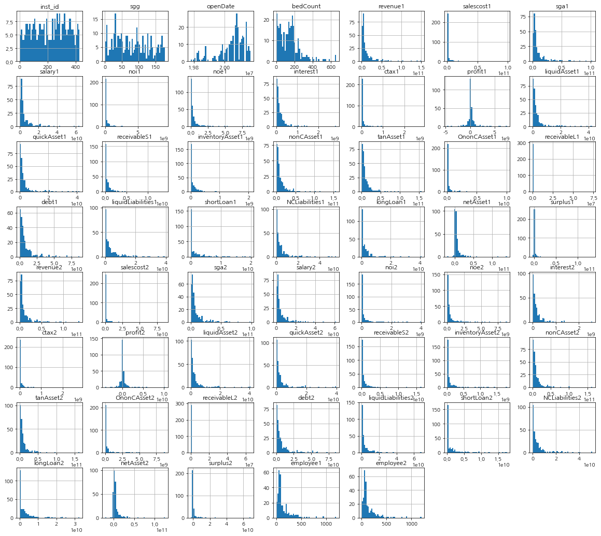
    


#### 결측치 확인 및 이상치 처리


```python
fig, ax = plt.subplots(nrows=1, ncols=2, figsize=(20, 7))
sns.heatmap(train.isnull(), ax=ax[0]).set_title("Train Missing")
sns.heatmap(test.isnull(), ax=ax[1]).set_title("Test Missing")
plt.show()
```


    
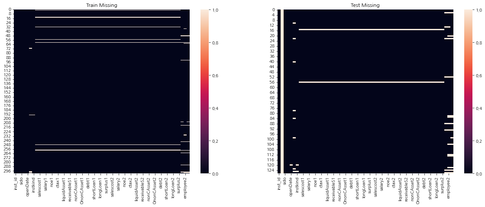
    


##### OC - 영업/폐업 분류


```python
train["OC"].isnull().sum(), test["OC"].isnull().sum()
```


    (0, 127)


`OC`는 예측해야하는 값이므로 test에는 결측치가 존재하는 것이 당연함


```python
_ = sns.countplot(x=train["OC"]).set_title("Train - OC")
```


    
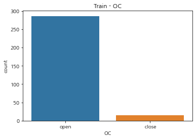
    


```python
train["OC"].value_counts(normalize=True)*100
```


    open      95.016611
     close     4.983389
    Name: OC, dtype: float64


오버 샘플링을 고려해 볼 만함

##### sido - 광역 지역 정보


```python
train["sido"].isnull().sum(), test["sido"].isnull().sum()
```


    (0, 0)


```python
fig, ax = plt.subplots(1, 2, figsize=(28, 8))
sns.countplot(data=train, x="sido", ax=ax[0]).set_title("Train - sido")
sns.countplot(data=test, x="sido", ax=ax[1]).set_title("Test - sido")
plt.show()
```


    
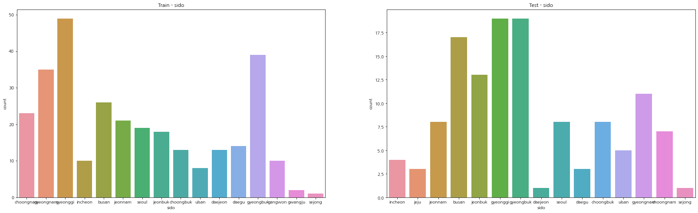
    


광역 지역을 좀 더 일반화 시키는 것이 좋을꺼 같다는 생각을 함


```python
set(train["sido"].value_counts().index) - set(test["sido"].value_counts().index)
```


    {'gangwon', 'gwangju'}


```python
train[train["sido"]=='gangwon'].shape, test[test["sido"]=='gangwon'].shape
```


    ((10, 58), (0, 58))


```python
train[train["sido"]=='gwangju'].shape, test[test["sido"]=='gwangju'].shape
```


    ((2, 58), (0, 58))


강원도와 광주의 경우 `train`에는 존재하지만 `test`에는 존재하지 않음


```python
set(test["sido"].value_counts().index) - set(train["sido"].value_counts().index)
```


    {'jeju'}


```python
train[train["sido"]=='jeju'].shape, test[test["sido"]=='jeju'].shape
```


    ((0, 58), (3, 58))


반대로, 제주도는 `test`에는 존재하지만 `train`에는 존재하지 않음  
먼저, 북과 남을 합쳐 도로 만들어 개수를 줄여봄


```python
# ~남 ~북을 제거, ex. 충남 -> 충 / 충북 -> 충
train["sido"] = train["sido"].str.replace("nam|buk", "")
test["sido"] = test["sido"].str.replace("nam|buk", "")
# 인천과 경기를 묶어줌
train["sido"] = train["sido"].str.replace("gyeonggi|incheon", "gyeon-in")
test["sido"] = test["sido"].str.replace("gyeonggi|incheon", "gyeon-in")
```

특별시나 광역시도 그냥 도로 편입 시킬까하다 진행하지 않음  
보기 좋게 한글명으로 변환


```python
train["sido"] = train["sido"].replace({"busan": "부산",
                                        "choong": "충청도",
                                        "daegu": "대구",
                                        "daejeon": "대전",
                                        "gangwon": "강원도",
                                        "gwangju": "광주",
                                        "gyeon-in": "경인",
                                        "gyeong": "경상도",
                                        "jeju": "제주도",
                                        "jeon": "전라도",
                                        "sejong": "세종",
                                        "seoul": "서울",
                                        "ulsan": "울산"})
test["sido"] = test["sido"].replace({"busan": "부산",
                                        "choong": "충청도",
                                        "daegu": "대구",
                                        "daejeon": "대전",
                                        "gangwon": "강원도",
                                        "gwangju": "광주",
                                        "gyeon-in": "경인",
                                        "gyeong": "경상도",
                                        "jeju": "제주도",
                                        "jeon": "전라도",
                                        "sejong": "세종",
                                        "seoul": "서울",
                                        "ulsan": "울산"})
```


```python
fig, ax = plt.subplots(1, 2, figsize=(28, 8))
sns.countplot(data=train, x="sido", ax=ax[0]).set_title("Train - sido")
sns.countplot(data=test, x="sido", ax=ax[1]).set_title("Test - sido")
plt.show()
```


    

    


`Train`과 `Test`에 공통적으로 존재하지 않는 데이터도 있어서, 모델 생성 및 평가시 조금 문제가 있었음  
앞으로는 이런 부분을 염두하고 좀 더 EDA 및 전처리를 해야 할 듯..

##### sgg - 시군구 자료


```python
train["sgg"].isnull().sum(), test["sgg"].isnull().sum()
```


    (0, 0)


##### openDate - 병원 설립일
데이터 타입을 `datetime`으로 변환하고 `년/월`만 남김


```python
train["openDate"].isnull().sum(), test["openDate"].isnull().sum()
```


    (0, 1)


```python
test["openDate"] = test["openDate"].fillna(0)
```


```python
train["openDate"] = pd.to_datetime(train["openDate"].astype("str"), format="%Y/%m/%d")
test["openDate"] = pd.to_datetime(test["openDate"].astype("int").astype("str"), format="%Y/%m/%d", errors="coerce")
```


```python
train["open_year"] = train["openDate"].dt.year
train["open_month"] = train["openDate"].dt.month
test["open_year"] = test["openDate"].dt.year
test["open_month"] = test["openDate"].dt.month

train.drop(columns="openDate", axis=1, inplace=True)
test.drop(columns="openDate", axis=1, inplace=True)
```


```python
fig, ax = plt.subplots(1, 2, figsize=(32, 8))
sns.countplot(data=train, x="open_year", ax=ax[0]).set_title("Train - Year")
sns.countplot(data=test, x="open_year", ax=ax[1]).set_title("Test - Year")
plt.show()
```


    
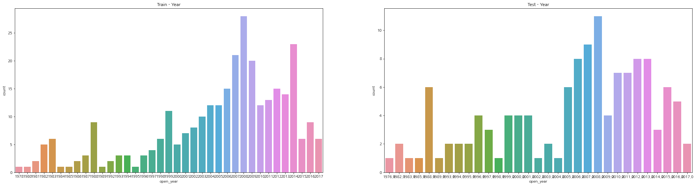
    


```python
fig, ax = plt.subplots(1, 2, figsize=(32, 8))
sns.countplot(data=train, x="open_month", ax=ax[0]).set_title("Train - Month")
sns.countplot(data=test, x="open_month", ax=ax[1]).set_title("Test - Month")
plt.show()
```


    
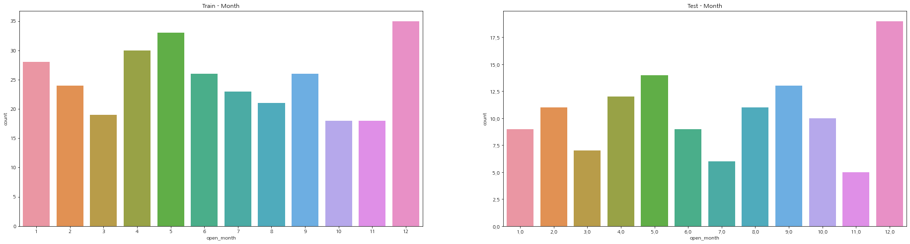
    


##### bedCount - 병원이 갖추고 있는 병상의 수


```python
train["bedCount"].isnull().sum(), test["bedCount"].isnull().sum()
```


    (5, 8)


결측치는 0으로 처리하는 방법도 있으나, 병원의 종류를 나타내는 `instkind`와 관련이 있을것이라고 생각함  
침상의 수를 구간별로 나누고, 없는 부분도 정보로써 활용해볼 예정

> 의원은 30병상 미만의 의료기관입니다.  
> 30~100병상 미만을 '병원'이라고 합니다.  
> 100~500병상 미만이면서 일정 수의 진료과목이 있고 진료과목마다 전문의를 두는 등의 특정 조건을 충족하면 종합병원으로 분류  
> 500병상 이상이면서 특정 조건을 충족하면 상급종합병원 자격이 됨

이라는 뉴스 기사를 참고해 이용했음


```python
_ = sns.histplot(data=train, x="bedCount")
```


    
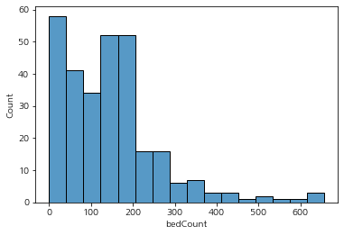
    


```python
def bedCount2band(num):
    if num<30: return "의원"
    elif 30<=num<100: return "병원"
    elif 100<=num<500: return "종합병원"
    elif num>=500: return "상급종합병원"
```


```python
train["bedCount"] = train["bedCount"].apply(bedCount2band)
test["bedCount"] = test["bedCount"].apply(bedCount2band)
```


```python
fig, ax = plt.subplots(1, 2, figsize=(20, 5))
sns.countplot(data=train, x="bedCount", ax=ax[0]).set_title("Train - bedCount")
sns.countplot(data=test, x="bedCount", ax=ax[1]).set_title("Test - bedCount")
plt.show()
```


    
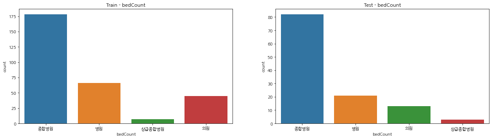
    


##### instkind - 병원의 종류


```python
train["instkind"].isnull().sum(), test["instkind"].isnull().sum()
```


    (1, 2)


```python
display(train[train["instkind"].isnull()])
display(test[test["instkind"].isnull()])
```


<div>
<style scoped>
    .dataframe tbody tr th:only-of-type {
        vertical-align: middle;
    }

    .dataframe tbody tr th {
        vertical-align: top;
    }

    .dataframe thead th {
        text-align: right;
    }
</style>
<table border="1" class="dataframe">
  <thead>
    <tr style="text-align: right;">
      <th></th>
      <th>inst_id</th>
      <th>OC</th>
      <th>sido</th>
      <th>sgg</th>
      <th>bedCount</th>
      <th>instkind</th>
      <th>revenue1</th>
      <th>salescost1</th>
      <th>sga1</th>
      <th>salary1</th>
      <th>...</th>
      <th>shortLoan2</th>
      <th>NCLiabilities2</th>
      <th>longLoan2</th>
      <th>netAsset2</th>
      <th>surplus2</th>
      <th>employee1</th>
      <th>employee2</th>
      <th>ownerChange</th>
      <th>open_year</th>
      <th>open_month</th>
    </tr>
  </thead>
  <tbody>
    <tr>
      <th>193</th>
      <td>281</td>
      <td>close</td>
      <td>경인</td>
      <td>12</td>
      <td>None</td>
      <td>NaN</td>
      <td>305438818.0</td>
      <td>22416139.0</td>
      <td>467475340.0</td>
      <td>254868810.0</td>
      <td>...</td>
      <td>0.0</td>
      <td>0.0</td>
      <td>0.0</td>
      <td>0.0</td>
      <td>0.0</td>
      <td>15.0</td>
      <td>15.0</td>
      <td>change</td>
      <td>2012</td>
      <td>12</td>
    </tr>
  </tbody>
</table>
<p>1 rows × 59 columns</p>
</div>


<div>
<style scoped>
    .dataframe tbody tr th:only-of-type {
        vertical-align: middle;
    }

    .dataframe tbody tr th {
        vertical-align: top;
    }

    .dataframe thead th {
        text-align: right;
    }
</style>
<table border="1" class="dataframe">
  <thead>
    <tr style="text-align: right;">
      <th></th>
      <th>inst_id</th>
      <th>OC</th>
      <th>sido</th>
      <th>sgg</th>
      <th>bedCount</th>
      <th>instkind</th>
      <th>revenue1</th>
      <th>salescost1</th>
      <th>sga1</th>
      <th>salary1</th>
      <th>...</th>
      <th>shortLoan2</th>
      <th>NCLiabilities2</th>
      <th>longLoan2</th>
      <th>netAsset2</th>
      <th>surplus2</th>
      <th>employee1</th>
      <th>employee2</th>
      <th>ownerChange</th>
      <th>open_year</th>
      <th>open_month</th>
    </tr>
  </thead>
  <tbody>
    <tr>
      <th>120</th>
      <td>413</td>
      <td>NaN</td>
      <td>경인</td>
      <td>168</td>
      <td>병원</td>
      <td>NaN</td>
      <td>5.583625e+08</td>
      <td>7.443415e+07</td>
      <td>5.482900e+08</td>
      <td>2.826852e+08</td>
      <td>...</td>
      <td>0.0</td>
      <td>0.000000e+00</td>
      <td>0.000000e+00</td>
      <td>0.0</td>
      <td>0.0</td>
      <td>21</td>
      <td>21</td>
      <td>same</td>
      <td>NaN</td>
      <td>NaN</td>
    </tr>
    <tr>
      <th>125</th>
      <td>430</td>
      <td>NaN</td>
      <td>제주도</td>
      <td>76</td>
      <td>None</td>
      <td>NaN</td>
      <td>4.892710e+10</td>
      <td>4.157148e+10</td>
      <td>4.721485e+09</td>
      <td>1.514547e+09</td>
      <td>...</td>
      <td>0.0</td>
      <td>2.871805e+10</td>
      <td>2.563120e+10</td>
      <td>-205062936.0</td>
      <td>0.0</td>
      <td>363</td>
      <td>343</td>
      <td>same</td>
      <td>2001.0</td>
      <td>2.0</td>
    </tr>
  </tbody>
</table>
<p>2 rows × 59 columns</p>
</div>


```python
train["instkind"].unique()
```


    array(['nursing_hospital', 'general_hospital', 'hospital',
           'traditional_clinic', 'clinic', 'traditional_hospital',
           'dental_clinic', nan], dtype=object)


##### float형 변수
결측치는 `-999`로 대체  
해당 부분도 시간적 여유를 가지고 이상치 탐색 및 결측치 처리를 좀 더 했어야했음..


```python
same_col = ["inst_id", "OC", "sido", "sgg", "bedCount", "instkind"]
in_col_train = train.columns.tolist()[6:]
in_col_test = test.columns.tolist()[6:]
```


```python
temp = train[in_col_train].replace(0, -999)
temp = temp.fillna(-999)

pre_train = pd.concat([train[same_col], temp], axis=1)
```


```python
temp = test[in_col_test].replace(0, -999)
temp = temp.fillna(-999)

pre_test = pd.concat([test[same_col], temp], axis=1)
```

`ownerChange`는 `nan`유지


```python
pre_train["ownerChange"] = pre_train["ownerChange"].replace(-999, np.nan)
pre_test["ownerChange"] = pre_test["ownerChange"].replace(-999, np.nan)

# pre_train.to_csv("data/pre_train.csv", index=False)
# pre_test.to_csv("data/pre_test.csv", index=False)
train, test = pre_train, pre_test
```

### 범주형 변수 -> 수치형 변수
`OC, sido, bedCount, instkind, ownerChange`를 변경해줘야함


```python
obj2num = ["OC", "sido", "bedCount", "instkind", "ownerChange"]
```


```python
# train
temp_arr = []
for col in obj2num:
    temp_arr.append(pd.get_dummies(train[col], drop_first=True))

temp = pd.concat(temp_arr, axis=1)
df_train = pd.concat([temp, train.drop(columns=obj2num, axis=1)], axis=1) 

# test
temp_arr = []
for col in obj2num:
    temp_arr.append(pd.get_dummies(test[col], drop_first=True))

temp = pd.concat(temp_arr, axis=1)
df_test = pd.concat([temp, test.drop(columns=obj2num, axis=1)], axis=1) 
```

#### Train - Data Split


```python
label = "open"
feature_names = df_train.columns.tolist()
feature_names.remove(label)
feature_names.remove("dental_clinic")
feature_names.remove("경상도")
feature_names.remove("광주")
```


```python
df_test.drop(columns="제주도", axis=1, inplace=True)
```

공통으로 존재하지 않는 피처라 제외하고 모델 생성시 이용


```python
df_test["employee1"] = df_test["employee1"].str.replace(",","").astype("float")
df_test["employee2"] = df_test["employee2"].str.replace(",","").astype("float")
```

EDA시 데이터 타입을 확인해주지 못했어서.. 


```python
X_train, X_valid, y_train, y_valid = train_test_split(df_train[feature_names], df_train[label], test_size=0.15, stratify=df_train[label])

print(f"X_train: {X_train.shape}\ny_train: {y_train.shape}\nX_valid: {X_valid.shape}\ny_valid: {y_valid.shape}")
```

    X_train: (255, 72)
    y_train: (255,)
    X_valid: (46, 72)
    y_valid: (46,)
    

#### Random Forest


```python
clf_rf = RandomForestClassifier()

clf_rf.fit(X_train, y_train)

pred_rf = clf_rf.predict(X_valid)
```


```python
eval_CM(y_valid, pred_rf, 1)
```

    정확도: 0.9565
    정밀도: 0.9565
    재현율: 1.0000
    F1: 0.9778
    


```python
plt.figure(figsize=(23, 15))
_ = sns.barplot(x=clf_rf.feature_importances_, y=clf_rf.feature_names_in_)
plt.show()
```


    
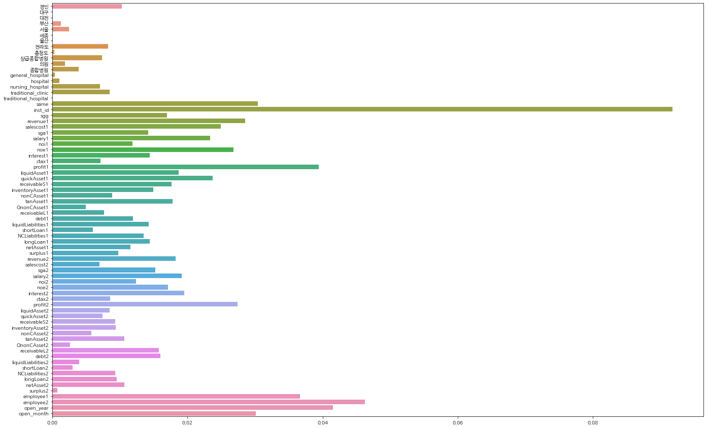
    


#### XGBoost


```python
clf_xgb = XGBClassifier()

clf_xgb.fit(X_train, y_train)

pred_xgb = clf_xgb.predict(X_valid)
```
    


```python
eval_CM(y_valid, pred_xgb, 1)
```

    정확도: 0.9565
    정밀도: 0.9565
    재현율: 1.0000
    F1: 0.9778
    


```python
_ = xgb.plot_importance(clf_xgb)
fig = _.figure
fig.set_size_inches(23, 10)
```


    
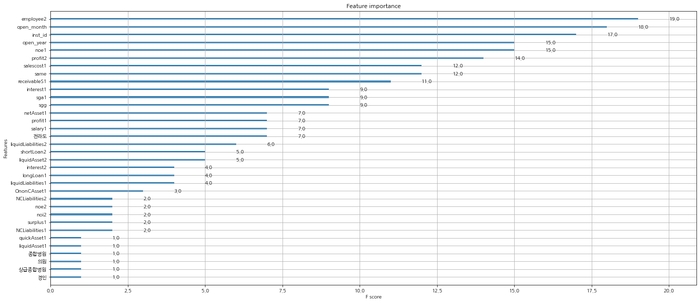
    


#### LGBM


```python
clf_lgbm = LGBMClassifier()

clf_lgbm.fit(X_train, y_train)

pred_lgbm = clf_lgbm.predict(X_valid)
```


```python
eval_CM(y_valid, pred_lgbm, 1)
```

    정확도: 0.9565
    정밀도: 0.9565
    재현율: 1.0000
    F1: 0.9778
    


```python
_ = lgbm.plot_importance(clf_lgbm, figsize=(23, 10))
```


    
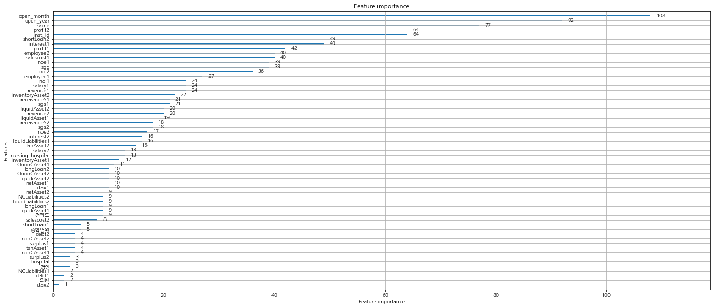
    


### 마무리
EDA를 좀 더 자세하게 진행하는 연습을하자  
제출시, RF와 XGB 모델은 pubplic: 87 / private: 82.8로 유사한 결과가 나왔고,  
LGBM은 pubplic은 비슷했지만, private: 84.3로 가장 점수가 높았다.  
Stacking 모델도 생성하기는 했으나, 제출 제한 횟수가 있어 평가를하지는 못했다.
