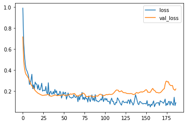
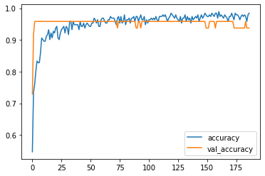

# DACON 병원 개/폐업 분류 예측 경진대회
[DACON 병원 개/폐업 분류 예측 경진대회](https://dacon.io/competitions/official/9565/overview/description)  

머신 러닝으로했던 주제를 딥러닝을 이용해 해결해봄  
[DACON 병원 개업/폐업 분류 예측 경진대회 머신러닝 버전](https://nuyhc.github.io/machine%20learning/hospital_open_close_prediction_forecast/)  

딥러닝 공부 초반부라 제대로 된건지는 모르겠지만, 제출시 85점이라는 준수한 성적이 나왔다.  
역시 정형 데이터는 딥러닝보다는 머신러닝의 성능(87점)이 더 좋은것 같다.

## Tensorflow

### 사용 라이브러리


```python
import pandas as pd
import numpy as np
from sklearn.model_selection import train_test_split
from sklearn.metrics import accuracy_score

import tensorflow as tf
from keras.callbacks import EarlyStopping

import matplotlib.pyplot as plt
import seaborn as sns

import warnings
warnings.filterwarnings("ignore")
```

### Data Load
이전에 머신러닝으로 해당 데이터를 다룰 때 이용한 전처리를 그대로 적용함


```python
train = pd.read_csv("pre_train.csv")
test = pd.read_csv("pre_test.csv")

train.shape, test.shape
```


    ((301, 76), (127, 72))


### Train


```python
label = "open"
feature_names = train.columns.tolist()
feature_names.remove(label)
feature_names.remove("dental_clinic")
feature_names.remove("경상도")
feature_names.remove("광주")
```


```python
x_train, x_test, y_train, y_test = train_test_split(train[feature_names], train[label], test_size=0.2, stratify=train[label])

print(f"x_train: {x_train.shape}\ny_train: {y_train.shape}\nx_test: {x_test.shape}\ny_test: {y_test.shape}")
```

    x_train: (240, 72)
    y_train: (240,)
    x_test: (61, 72)
    y_test: (61,)
    

### Model and Train


```python
model = tf.keras.models.Sequential([
    tf.keras.layers.Dense(72, input_shape=[x_train.shape[1]]),
    tf.keras.layers.BatchNormalization(),
    tf.keras.layers.Dense(144, activation="relu"),
    tf.keras.layers.Dropout(0.5),
    tf.keras.layers.BatchNormalization(),
    tf.keras.layers.Dense(256, activation="swish"),
    tf.keras.layers.Dense(128, activation="swish"),
    tf.keras.layers.Dropout(0.2),
    tf.keras.layers.BatchNormalization(),
    tf.keras.layers.Dense(32, activation="relu"),
    tf.keras.layers.Dropout(0.5),
    tf.keras.layers.Dense(1, activation="sigmoid")
])
```


```python
with tf.device("/device:GPU:0"):
    model.compile(optimizer="adam",
                  loss="binary_crossentropy",
                  metrics=["accuracy"]
                  )
```


```python
early_stopping = EarlyStopping(monitor="val_loss", patience=100)

with tf.device("/device:GPU:0"):
    history = model.fit(x_train, y_train, verbose=0, validation_split=0.2, epochs=1000, callbacks=[early_stopping])
```


```python
df_hist = pd.DataFrame(history.history)
df_hist.tail()
```


<div>
<style scoped>
    .dataframe tbody tr th:only-of-type {
        vertical-align: middle;
    }

    .dataframe tbody tr th {
        vertical-align: top;
    }

    .dataframe thead th {
        text-align: right;
    }
</style>
<table border="1" class="dataframe">
  <thead>
    <tr style="text-align: right;">
      <th></th>
      <th>loss</th>
      <th>accuracy</th>
      <th>val_loss</th>
      <th>val_accuracy</th>
    </tr>
  </thead>
  <tbody>
    <tr>
      <th>127</th>
      <td>0.041207</td>
      <td>0.994792</td>
      <td>0.593282</td>
      <td>0.9375</td>
    </tr>
    <tr>
      <th>128</th>
      <td>0.028480</td>
      <td>0.989583</td>
      <td>0.590325</td>
      <td>0.9375</td>
    </tr>
    <tr>
      <th>129</th>
      <td>0.031031</td>
      <td>0.984375</td>
      <td>0.585470</td>
      <td>0.9375</td>
    </tr>
    <tr>
      <th>130</th>
      <td>0.047607</td>
      <td>0.979167</td>
      <td>0.588387</td>
      <td>0.9375</td>
    </tr>
    <tr>
      <th>131</th>
      <td>0.029272</td>
      <td>0.994792</td>
      <td>0.592212</td>
      <td>0.9375</td>
    </tr>
  </tbody>
</table>
</div>


```python
_ = df_hist[["loss", "val_loss"]].plot()
```


    

    


```python
_ = df_hist[["accuracy", "val_accuracy"]].plot()
```


    


    


### Evaluate


```python
y_pred = model.predict(x_test).flatten()
```

    2/2 [==============================] - 0s 3ms/step
    


```python
pred = (y_pred>0.5).astype(int)
```


```python
accuracy_score(pred, y_test)
```


    0.9508196721311475


```python
test_loss, test_acc = model.evaluate(x_test,y_test)
print('test loss :',np.round(test_loss,4))
print('test acc :',np.round(test_acc,4))
```

    2/2 [==============================] - 0s 6ms/step - loss: 0.2958 - accuracy: 0.9508
    test loss : 0.2958
    test acc : 0.9508
    

### Submission


```python
from glob import glob

sub = pd.read_csv(glob("data/*")[2])
```


```python
pred = model.predict(test[feature_names])
pred = (pred>0.5).astype(int)
sub["OC"] = pred
sub.to_csv("sub_tf.csv", index=False)
```

    4/4 [==============================] - 0s 19ms/step

### 마무리
public: 0.85 / private: 0.84가 나옴  
머신러닝 알고리즘(RF, XGBoost, LGBM)들이 public: 0.87이 나온 것에 비해 낮은 점수임