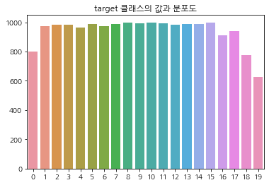

## 텍스트 분류 실습 - 20 뉴스 그룹 분류
텍스트 분류는 특정 문서의 분류를 학습 데이터를 통해 학습해 모델을 생선한 뒤 학습 모델을 이용해 다른 문서의 분류를 예측하는 것

### 텍스트 정규화


```python
from sklearn.datasets import fetch_20newsgroups

news_data = fetch_20newsgroups(subset="all")
```


```python
news_data.keys()
```


    dict_keys(['data', 'filenames', 'target_names', 'target', 'DESCR'])


```python
temp
```


    0     799
    1     973
    2     985
    3     982
    4     963
    5     988
    6     975
    7     990
    8     996
    9     994
    10    999
    11    991
    12    984
    13    990
    14    987
    15    997
    16    910
    17    940
    18    775
    19    628
    dtype: int64


```python
import pandas as pd
import matplotlib.pyplot as plt
import seaborn as sns
import koreanize_matplotlib

temp = pd.Series(news_data.target).value_counts().sort_index()
_ = sns.barplot(y=temp.values, x=temp.index, ci=None).set_title("target 클래스의 값과 분포도")
```


    

    


```python
news_data.target_names
```


    ['alt.atheism',
     'comp.graphics',
     'comp.os.ms-windows.misc',
     'comp.sys.ibm.pc.hardware',
     'comp.sys.mac.hardware',
     'comp.windows.x',
     'misc.forsale',
     'rec.autos',
     'rec.motorcycles',
     'rec.sport.baseball',
     'rec.sport.hockey',
     'sci.crypt',
     'sci.electronics',
     'sci.med',
     'sci.space',
     'soc.religion.christian',
     'talk.politics.guns',
     'talk.politics.mideast',
     'talk.politics.misc',
     'talk.religion.misc']


```python
news_data.data[0]
```


    "From: Mamatha Devineni Ratnam <mr47+@andrew.cmu.edu>\nSubject: Pens fans reactions\nOrganization: Post Office, Carnegie Mellon, Pittsburgh, PA\nLines: 12\nNNTP-Posting-Host: po4.andrew.cmu.edu\n\n\n\nI am sure some bashers of Pens fans are pretty confused about the lack\nof any kind of posts about the recent Pens massacre of the Devils. Actually,\nI am  bit puzzled too and a bit relieved. However, I am going to put an end\nto non-PIttsburghers' relief with a bit of praise for the Pens. Man, they\nare killing those Devils worse than I thought. Jagr just showed you why\nhe is much better than his regular season stats. He is also a lot\nfo fun to watch in the playoffs. Bowman should let JAgr have a lot of\nfun in the next couple of games since the Pens are going to beat the pulp out of Jersey anyway. I was very disappointed not to see the Islanders lose the final\nregular season game.          PENS RULE!!!\n\n"


기사의 내용뿐만 아니라, 제목, 작성자, 소속, 이메일 등의 다양한 정보를 갖고 있음


```python
# 학습용 데이터만 추출
train_news = fetch_20newsgroups(subset="train", remove=("headers", "footers", "quotes"))
X_train = train_news.data
y_train = train_news.target

# 테스트용 데이터만 추출
test_news = fetch_20newsgroups(subset="test", remove=("header", "footers", "quotes"))
X_test = test_news.data
y_test = test_news.target
```


```python
len(X_train), len(X_test)
```


    (11314, 7532)


### 피처 벡터화 변환과 머신러닝 모델 학습/예측/평가
로지스틱 회귀, SVM, 나이브 베이즈 알고리즘은 희소 행렬 기반의 텍스트 분류에 자주 사용되는 모델임
#### Count 기반


```python
from sklearn.feature_extraction.text import CountVectorizer

cnt_vect = CountVectorizer()
cnt_vect.fit(X_train)
X_train_cnt_vect = cnt_vect.transform(X_train)

X_test_cnt_vect =cnt_vect.transform(X_test)

X_train_cnt_vect.shape, X_test_cnt_vect.shape
```


    ((11314, 101631), (7532, 101631))


```python
from sklearn.linear_model import LogisticRegression
from sklearn.metrics import accuracy_score

lr_clf = LogisticRegression(max_iter=10000)
lr_clf.fit(X_train_cnt_vect, y_train)

pred = lr_clf.predict(X_test_cnt_vect)

accuracy_score(y_test, pred)
```


    0.6379447689856612


#### TF-IDF


```python
from sklearn.feature_extraction.text import TfidfVectorizer

tfidf_vect = TfidfVectorizer()
tfidf_vect.fit(X_train)
X_train_tfidf_vect = tfidf_vect.transform(X_train)
X_test_tfidf_vect = tfidf_vect.transform(X_test)

X_train_tfidf_vect.shape, X_test_tfidf_vect.shape
```


    ((11314, 101631), (7532, 101631))


```python
lr_clf = LogisticRegression(max_iter=10000)
lr_clf.fit(X_train_tfidf_vect, y_train)

pred = lr_clf.predict(X_test_tfidf_vect)

accuracy_score(y_test, pred)
```


    0.710169941582581


count 방식 보다 tf-idf 방식이 더 높은 예측 성능을 보임


```python
from sklearn.model_selection import GridSearchCV

params = {"C": [0.01, 0.1, 1, 5, 10]}
grid_cv_lr = GridSearchCV(lr_clf, param_grid=params, cv=3, scoring="accuracy", verbose=1)
grid_cv_lr.fit(X_train_tfidf_vect, y_train)
```

    Fitting 3 folds for each of 5 candidates, totalling 15 fits
    


<style>#sk-container-id-1 {color: black;background-color: white;}#sk-container-id-1 pre{padding: 0;}#sk-container-id-1 div.sk-toggleable {background-color: white;}#sk-container-id-1 label.sk-toggleable__label {cursor: pointer;display: block;width: 100%;margin-bottom: 0;padding: 0.3em;box-sizing: border-box;text-align: center;}#sk-container-id-1 label.sk-toggleable__label-arrow:before {content: "▸";float: left;margin-right: 0.25em;color: #696969;}#sk-container-id-1 label.sk-toggleable__label-arrow:hover:before {color: black;}#sk-container-id-1 div.sk-estimator:hover label.sk-toggleable__label-arrow:before {color: black;}#sk-container-id-1 div.sk-toggleable__content {max-height: 0;max-width: 0;overflow: hidden;text-align: left;background-color: #f0f8ff;}#sk-container-id-1 div.sk-toggleable__content pre {margin: 0.2em;color: black;border-radius: 0.25em;background-color: #f0f8ff;}#sk-container-id-1 input.sk-toggleable__control:checked~div.sk-toggleable__content {max-height: 200px;max-width: 100%;overflow: auto;}#sk-container-id-1 input.sk-toggleable__control:checked~label.sk-toggleable__label-arrow:before {content: "▾";}#sk-container-id-1 div.sk-estimator input.sk-toggleable__control:checked~label.sk-toggleable__label {background-color: #d4ebff;}#sk-container-id-1 div.sk-label input.sk-toggleable__control:checked~label.sk-toggleable__label {background-color: #d4ebff;}#sk-container-id-1 input.sk-hidden--visually {border: 0;clip: rect(1px 1px 1px 1px);clip: rect(1px, 1px, 1px, 1px);height: 1px;margin: -1px;overflow: hidden;padding: 0;position: absolute;width: 1px;}#sk-container-id-1 div.sk-estimator {font-family: monospace;background-color: #f0f8ff;border: 1px dotted black;border-radius: 0.25em;box-sizing: border-box;margin-bottom: 0.5em;}#sk-container-id-1 div.sk-estimator:hover {background-color: #d4ebff;}#sk-container-id-1 div.sk-parallel-item::after {content: "";width: 100%;border-bottom: 1px solid gray;flex-grow: 1;}#sk-container-id-1 div.sk-label:hover label.sk-toggleable__label {background-color: #d4ebff;}#sk-container-id-1 div.sk-serial::before {content: "";position: absolute;border-left: 1px solid gray;box-sizing: border-box;top: 0;bottom: 0;left: 50%;z-index: 0;}#sk-container-id-1 div.sk-serial {display: flex;flex-direction: column;align-items: center;background-color: white;padding-right: 0.2em;padding-left: 0.2em;position: relative;}#sk-container-id-1 div.sk-item {position: relative;z-index: 1;}#sk-container-id-1 div.sk-parallel {display: flex;align-items: stretch;justify-content: center;background-color: white;position: relative;}#sk-container-id-1 div.sk-item::before, #sk-container-id-1 div.sk-parallel-item::before {content: "";position: absolute;border-left: 1px solid gray;box-sizing: border-box;top: 0;bottom: 0;left: 50%;z-index: -1;}#sk-container-id-1 div.sk-parallel-item {display: flex;flex-direction: column;z-index: 1;position: relative;background-color: white;}#sk-container-id-1 div.sk-parallel-item:first-child::after {align-self: flex-end;width: 50%;}#sk-container-id-1 div.sk-parallel-item:last-child::after {align-self: flex-start;width: 50%;}#sk-container-id-1 div.sk-parallel-item:only-child::after {width: 0;}#sk-container-id-1 div.sk-dashed-wrapped {border: 1px dashed gray;margin: 0 0.4em 0.5em 0.4em;box-sizing: border-box;padding-bottom: 0.4em;background-color: white;}#sk-container-id-1 div.sk-label label {font-family: monospace;font-weight: bold;display: inline-block;line-height: 1.2em;}#sk-container-id-1 div.sk-label-container {text-align: center;}#sk-container-id-1 div.sk-container {/* jupyter's `normalize.less` sets `[hidden] { display: none; }` but bootstrap.min.css set `[hidden] { display: none !important; }` so we also need the `!important` here to be able to override the default hidden behavior on the sphinx rendered scikit-learn.org. See: https://github.com/scikit-learn/scikit-learn/issues/21755 */display: inline-block !important;position: relative;}#sk-container-id-1 div.sk-text-repr-fallback {display: none;}</style><div id="sk-container-id-1" class="sk-top-container"><div class="sk-text-repr-fallback"><pre>GridSearchCV(cv=3, estimator=LogisticRegression(max_iter=10000),
             param_grid={&#x27;C&#x27;: [0.01, 0.1, 1, 5, 10]}, scoring=&#x27;accuracy&#x27;,
             verbose=1)</pre><b>In a Jupyter environment, please rerun this cell to show the HTML representation or trust the notebook. <br />On GitHub, the HTML representation is unable to render, please try loading this page with nbviewer.org.</b></div><div class="sk-container" hidden><div class="sk-item sk-dashed-wrapped"><div class="sk-label-container"><div class="sk-label sk-toggleable"><input class="sk-toggleable__control sk-hidden--visually" id="sk-estimator-id-1" type="checkbox" ><label for="sk-estimator-id-1" class="sk-toggleable__label sk-toggleable__label-arrow">GridSearchCV</label><div class="sk-toggleable__content"><pre>GridSearchCV(cv=3, estimator=LogisticRegression(max_iter=10000),
             param_grid={&#x27;C&#x27;: [0.01, 0.1, 1, 5, 10]}, scoring=&#x27;accuracy&#x27;,
             verbose=1)</pre></div></div></div><div class="sk-parallel"><div class="sk-parallel-item"><div class="sk-item"><div class="sk-label-container"><div class="sk-label sk-toggleable"><input class="sk-toggleable__control sk-hidden--visually" id="sk-estimator-id-2" type="checkbox" ><label for="sk-estimator-id-2" class="sk-toggleable__label sk-toggleable__label-arrow">estimator: LogisticRegression</label><div class="sk-toggleable__content"><pre>LogisticRegression(max_iter=10000)</pre></div></div></div><div class="sk-serial"><div class="sk-item"><div class="sk-estimator sk-toggleable"><input class="sk-toggleable__control sk-hidden--visually" id="sk-estimator-id-3" type="checkbox" ><label for="sk-estimator-id-3" class="sk-toggleable__label sk-toggleable__label-arrow">LogisticRegression</label><div class="sk-toggleable__content"><pre>LogisticRegression(max_iter=10000)</pre></div></div></div></div></div></div></div></div></div></div>


```python
grid_cv_lr.best_params_
```


    {'C': 10}


```python
pred = grid_cv_lr.predict(X_test_tfidf_vect)

accuracy_score(y_test, pred)
```


    0.7214551248008497


## 감성 분석(Sentiment Analysis)
문서의 주관적인 감성/의견/감정/기분 등을 파악하기 위한 방법  
문서 내 텍스트가 나타내는 여러 가지 주관적인 단어와 문맥을 기반으로 감성(Sentiment) 수치를 계산하는 방법을 이용

- 지도 학습
  - 학습 데이터와 타깃 레이블 값을 기반으로 감성 분석 학습을 수행한 뒤 이를 기반으로 다른 데이터의 감성 분석을 예측하는 방법
- 비지도 학습
  - `Lexicon`이라 불리는 일종의 감성 어휘 사전을 이용

### 지도학습 기반 감성 분석 - IMDB 영화평
[Kaggle 데이터 셋](https://www.kaggle.com/c/word2vec-nlp-tutorial)


```python
review = pd.read_csv("./word2vec-nlp-tutorial/labeledTrainData.tsv", header=0, sep="\t", quoting=3)
print(review.shape)
review.head(3)
```

    (25000, 3)
    


<div>
<style scoped>
    .dataframe tbody tr th:only-of-type {
        vertical-align: middle;
    }

    .dataframe tbody tr th {
        vertical-align: top;
    }

    .dataframe thead th {
        text-align: right;
    }
</style>
<table border="1" class="dataframe">
  <thead>
    <tr style="text-align: right;">
      <th></th>
      <th>id</th>
      <th>sentiment</th>
      <th>review</th>
    </tr>
  </thead>
  <tbody>
    <tr>
      <th>0</th>
      <td>"5814_8"</td>
      <td>1</td>
      <td>"With all this stuff going down at the moment ...</td>
    </tr>
    <tr>
      <th>1</th>
      <td>"2381_9"</td>
      <td>1</td>
      <td>"\"The Classic War of the Worlds\" by Timothy ...</td>
    </tr>
    <tr>
      <th>2</th>
      <td>"7759_3"</td>
      <td>0</td>
      <td>"The film starts with a manager (Nicholas Bell...</td>
    </tr>
  </tbody>
</table>
</div>


#### Cleansing


```python
import re
review["review"] = review["review"].str.replace("<br />", " ")
review["review"] = review["review"].apply(lambda x: re.sub("[^a-zA-Z]", " ", x))
```

#### 데이터 나누기


```python
from sklearn.model_selection import train_test_split

class_df = review["sentiment"]
feature_df = review.drop(["id", "sentiment"], axis=1, inplace=False)

X_train, X_test, y_train, y_test = train_test_split(feature_df, class_df, test_size=0.3)

X_train.shape, y_train.shape, X_test.shape, y_test.shape
```


    ((17500, 1), (17500,), (7500, 1), (7500,))


```python
# 파이프라인 이용
# Count vect
from sklearn.pipeline import Pipeline
from sklearn.metrics import accuracy_score, roc_auc_score

pipeline = Pipeline([
    ("cnt_vect", CountVectorizer(stop_words="english", ngram_range=(1, 2))),
    ("lr_clf", LogisticRegression(C=10))
])

pipeline.fit(X_train["review"], y_train)
pred = pipeline.predict(X_test["review"])
pred_probs = pipeline.predict_proba(X_test["review"])[:, 1]
```

    c:\Users\spec3\anaconda3\envs\Deep\lib\site-packages\sklearn\linear_model\_logistic.py:444: ConvergenceWarning: lbfgs failed to converge (status=1):
    STOP: TOTAL NO. of ITERATIONS REACHED LIMIT.
    
    Increase the number of iterations (max_iter) or scale the data as shown in:
        https://scikit-learn.org/stable/modules/preprocessing.html
    Please also refer to the documentation for alternative solver options:
        https://scikit-learn.org/stable/modules/linear_model.html#logistic-regression
      n_iter_i = _check_optimize_result(
    


```python
print(accuracy_score(y_test, pred))
print(roc_auc_score(y_test, pred_probs))
```

    0.8864
    0.9494331795815925
    


```python
# TF-IDF
pipeline = Pipeline([
    ("tfidf_vect", TfidfVectorizer(stop_words="english", ngram_range=(1, 2))),
    ("lr_clf", LogisticRegression(C=10))
])

pipeline.fit(X_train["review"], y_train)
pred = pipeline.predict(X_test["review"])
pred_probs = pipeline.predict_proba(X_test["review"])[:, 1]
```

    c:\Users\spec3\anaconda3\envs\Deep\lib\site-packages\sklearn\linear_model\_logistic.py:444: ConvergenceWarning: lbfgs failed to converge (status=1):
    STOP: TOTAL NO. of ITERATIONS REACHED LIMIT.
    
    Increase the number of iterations (max_iter) or scale the data as shown in:
        https://scikit-learn.org/stable/modules/preprocessing.html
    Please also refer to the documentation for alternative solver options:
        https://scikit-learn.org/stable/modules/linear_model.html#logistic-regression
      n_iter_i = _check_optimize_result(
    


```python
print(accuracy_score(y_test, pred))
print(roc_auc_score(y_test, pred_probs))
```

    0.8917333333333334
    0.9591214096827826
    

### 비지도학습 기반 감성 분석
TA을 하다보면, `시맨틱(semantic)`이라는 용어가 자주 나옴  -> `문맥상 의미`  
종류만 소개하고 실습은 진행하지 않음  

#### SentiWordNet
#### VADER
#### Pattern

## 토픽 모델링(Topic Modeling)
문서 집합에 숨어 있는 주제를 찾아내는 것
- LSA(Latent Semantic Analysis)
- LDA(Latent Dirichlet Allocation)


```python
from sklearn.datasets import fetch_20newsgroups
from sklearn.feature_extraction.text import CountVectorizer
from sklearn.decomposition import LatentDirichletAllocation

cats = ["rec.motorcycles", "rec.sport.baseball", "comp.graphics", "comp.windows.x", "talk.politics.mideast", "soc.religion.christian", "sci.electronics", "sci.med"]

news_df = fetch_20newsgroups(subset="all", remove=("headers", "footers", "quotes"), categories=cats)

count_vect = CountVectorizer(max_df=0.95, max_features=1000, min_df=2, stop_words="english", ngram_range=(1, 2))

feat_vect = count_vect.fit_transform(news_df.data)

feat_vect.shape
```


    (7862, 1000)


```python
lda = LatentDirichletAllocation(n_components=8)
lda.fit(feat_vect)

lda.components_.shape
```


    (8, 1000)


```python
def display_topics(model, feature_names, no_top_words):
    for topic_index, topic in enumerate(model.components_):
        print("Topic #", topic_index)
        
        topic_word_indexes = topic.argsort()[::-1]
        top_indexes = topic_word_indexes[:no_top_words]
        
        feature_concat = " ".join([feature_names[i] for i in top_indexes])
        print(feature_concat)
        
feature_names = count_vect.get_feature_names_out()

display_topics(lda, feature_names, 15)
```

    Topic # 0
    edu image file available graphics jpeg ftp com files data version use software pub images
    Topic # 1
    don just like think time good know year ve ll going bike didn really right
    Topic # 2
    know thanks like does use help need just don mail ve used information want good
    Topic # 3
    file output program entry university ed widget error include use lib int return istanbul build
    Topic # 4
    window dos windows dos dos server use display using running pc key application problem run memory
    Topic # 5
    people think jews don does believe say know just like did question christian way christians
    Topic # 6
    armenian people armenians said israel turkish israeli children 000 medical government arab health killed new
    Topic # 7
    god jesus christ sin man love church lord father faith son life spirit hell bible
    

## 문서 군집화(Document Clustering)
비슷한 텍스트 구성의 문서를 군집화(Clustering)하는 것  
동일한 군집에 속하는 문서를 같은 카테고리 소속으로 분류할 수 있으므로, 텍스트 분류 기반의 문서 분류와 유사  
### Opinion Review 데이터 셋


```python
import pandas as pd
import glob, os

path = r"./OpinosisDataset1.0/topics/"
all_files = glob.glob(os.path.join(path, "*.data"))
filename_list = []
opinion_text = []

for file_ in all_files:
    df = pd.read_table(file_, index_col=None, header=0, encoding="latin1")
    filename_ = file_.split("\\")[-1]
    filename = filename_.split(".")[0]
    
    filename_list.append(filename)
    opinion_text.append(df.to_string())
    
document_df = pd.DataFrame({"filename":filename_list, "opinion_text":opinion_text})
document_df.head()
```


<div>
<style scoped>
    .dataframe tbody tr th:only-of-type {
        vertical-align: middle;
    }

    .dataframe tbody tr th {
        vertical-align: top;
    }

    .dataframe thead th {
        text-align: right;
    }
</style>
<table border="1" class="dataframe">
  <thead>
    <tr style="text-align: right;">
      <th></th>
      <th>filename</th>
      <th>opinion_text</th>
    </tr>
  </thead>
  <tbody>
    <tr>
      <th>0</th>
      <td>accuracy_garmin_nuvi_255W_gps</td>
      <td>...</td>
    </tr>
    <tr>
      <th>1</th>
      <td>bathroom_bestwestern_hotel_sfo</td>
      <td>...</td>
    </tr>
    <tr>
      <th>2</th>
      <td>battery-life_amazon_kindle</td>
      <td>...</td>
    </tr>
    <tr>
      <th>3</th>
      <td>battery-life_ipod_nano_8gb</td>
      <td>...</td>
    </tr>
    <tr>
      <th>4</th>
      <td>battery-life_netbook_1005ha</td>
      <td>...</td>
    </tr>
  </tbody>
</table>
</div>


```python
from nltk.stem import WordNetLemmatizer
import nltk
import string

remove_punct_dict = dict((ord(punct), None) for punct in string.punctuation)
lemmar = WordNetLemmatizer()

def LemTokens(tokens):
    return [lemmar.lemmatize(token) for token in tokens]

def LemNormalize(text):
    return LemTokens(nltk.word_tokenize(text.lower().translate(remove_punct_dict)))
```


```python
from sklearn.feature_extraction.text import TfidfVectorizer

tfidf_vect = TfidfVectorizer(tokenizer=LemNormalize, stop_words="english", ngram_range=(1, 2), min_df=0.05, max_df=0.85)
feature_vect = tfidf_vect.fit_transform(document_df["opinion_text"])
```


```python
from sklearn.cluster import KMeans

km_cluster = KMeans(n_clusters=5, max_iter=10000)
km_cluster.fit(feature_vect)
cluster_label = km_cluster.labels_
cluster_centers = km_cluster.cluster_centers_
```


```python
document_df["cluster_label"] = cluster_label
document_df.head()
```


<div>
<style scoped>
    .dataframe tbody tr th:only-of-type {
        vertical-align: middle;
    }

    .dataframe tbody tr th {
        vertical-align: top;
    }

    .dataframe thead th {
        text-align: right;
    }
</style>
<table border="1" class="dataframe">
  <thead>
    <tr style="text-align: right;">
      <th></th>
      <th>filename</th>
      <th>opinion_text</th>
      <th>cluster_label</th>
    </tr>
  </thead>
  <tbody>
    <tr>
      <th>0</th>
      <td>accuracy_garmin_nuvi_255W_gps</td>
      <td>...</td>
      <td>4</td>
    </tr>
    <tr>
      <th>1</th>
      <td>bathroom_bestwestern_hotel_sfo</td>
      <td>...</td>
      <td>0</td>
    </tr>
    <tr>
      <th>2</th>
      <td>battery-life_amazon_kindle</td>
      <td>...</td>
      <td>3</td>
    </tr>
    <tr>
      <th>3</th>
      <td>battery-life_ipod_nano_8gb</td>
      <td>...</td>
      <td>3</td>
    </tr>
    <tr>
      <th>4</th>
      <td>battery-life_netbook_1005ha</td>
      <td>...</td>
      <td>3</td>
    </tr>
  </tbody>
</table>
</div>


#### 군집별 핵심 단어 추출
KMeans 객체는 각 군집을 구성하는 단어 피처가 군집의 중심을 기준으로 얼마나 가깝게 위치해 있는지 `cluster_centers_`라는 속성으로 제공


```python
cluster_centers = km_cluster.cluster_centers_
cluster_centers.shape
```


    (5, 4611)


```python
# 군집별 top n 핵심단어, 그 단어의 중심 위치 상대값, 대상 파일명들을 반환함. 
def get_cluster_details(cluster_model, cluster_data, feature_names, clusters_num, top_n_features=10):
    cluster_details = {}
    
    # cluster_centers array 의 값이 큰 순으로 정렬된 index 값을 반환
    # 군집 중심점(centroid)별 할당된 word 피처들의 거리값이 큰 순으로 값을 구하기 위함.  
    centroid_feature_ordered_ind = cluster_model.cluster_centers_.argsort()[:,::-1]
    
    #개별 군집별로 iteration하면서 핵심단어, 그 단어의 중심 위치 상대값, 대상 파일명 입력
    for cluster_num in range(clusters_num):
        # 개별 군집별 정보를 담을 데이터 초기화. 
        cluster_details[cluster_num] = {}
        cluster_details[cluster_num]['cluster'] = cluster_num
        
        # cluster_centers_.argsort()[:,::-1] 로 구한 index 를 이용하여 top n 피처 단어를 구함. 
        top_feature_indexes = centroid_feature_ordered_ind[cluster_num, :top_n_features]
        top_features = [ feature_names[ind] for ind in top_feature_indexes ]
        
        # top_feature_indexes를 이용해 해당 피처 단어의 중심 위치 상댓값 구함 
        top_feature_values = cluster_model.cluster_centers_[cluster_num, top_feature_indexes].tolist()
        
        # cluster_details 딕셔너리 객체에 개별 군집별 핵심 단어와 중심위치 상대값, 그리고 해당 파일명 입력
        cluster_details[cluster_num]['top_features'] = top_features
        cluster_details[cluster_num]['top_features_value'] = top_feature_values
        filenames = cluster_data[cluster_data['cluster_label'] == cluster_num]['filename']
        filenames = filenames.values.tolist()
        cluster_details[cluster_num]['filenames'] = filenames
        
    return cluster_details

def print_cluster_details(cluster_details):
    for cluster_num, cluster_detail in cluster_details.items():
        print('####### Cluster {0}'.format(cluster_num))
        print('Top features:', cluster_detail['top_features'])
        print('Reviews 파일명 :',cluster_detail['filenames'][:7])
        print('==================================================')
```


```python
feature_names = tfidf_vect.get_feature_names_out()

cluster_details = get_cluster_details(cluster_model=km_cluster, cluster_data=document_df, feature_names=feature_names, clusters_num=5, top_n_features=10)

print_cluster_details(cluster_details)
```

    ####### Cluster 0
    Top features: ['room', 'hotel', 'service', 'staff', 'food', 'location', 'bathroom', 'clean', 'price', 'parking']
    Reviews 파일명 : ['bathroom_bestwestern_hotel_sfo', 'food_holiday_inn_london', 'food_swissotel_chicago', 'free_bestwestern_hotel_sfo', 'location_bestwestern_hotel_sfo', 'location_holiday_inn_london', 'parking_bestwestern_hotel_sfo']
    ==================================================
    ####### Cluster 1
    Top features: ['kindle', 'page', 'button', 'font', 'book', 'eye', 'price', 'navigation', 'font size', 'easy']
    Reviews 파일명 : ['buttons_amazon_kindle', 'eyesight-issues_amazon_kindle', 'fonts_amazon_kindle', 'navigation_amazon_kindle', 'price_amazon_kindle']
    ==================================================
    ####### Cluster 2
    Top features: ['interior', 'seat', 'mileage', 'comfortable', 'gas', 'gas mileage', 'transmission', 'car', 'performance', 'quality']
    Reviews 파일명 : ['comfort_honda_accord_2008', 'comfort_toyota_camry_2007', 'gas_mileage_toyota_camry_2007', 'interior_honda_accord_2008', 'interior_toyota_camry_2007', 'mileage_honda_accord_2008', 'performance_honda_accord_2008']
    ==================================================
    ####### Cluster 3
    Top features: ['battery', 'battery life', 'life', 'keyboard', 'performance', 'faster', 'sound', 'size', 'sound quality', 'laptop']
    Reviews 파일명 : ['battery-life_amazon_kindle', 'battery-life_ipod_nano_8gb', 'battery-life_netbook_1005ha', 'keyboard_netbook_1005ha', 'performance_netbook_1005ha', 'size_asus_netbook_1005ha', 'sound_ipod_nano_8gb']
    ==================================================
    ####### Cluster 4
    Top features: ['screen', 'direction', 'voice', 'map', 'feature', 'video', 'speed limit', 'accurate', 'speed', 'satellite']
    Reviews 파일명 : ['accuracy_garmin_nuvi_255W_gps', 'directions_garmin_nuvi_255W_gps', 'display_garmin_nuvi_255W_gps', 'features_windows7', 'satellite_garmin_nuvi_255W_gps', 'screen_garmin_nuvi_255W_gps', 'screen_ipod_nano_8gb']
    ==================================================
    

## 문서 유사도
### 문서 유사도 측정 방법 - 코사인 유사도(Cosine Similarity)
벡터와 벡터 간의 유사도를 비교 -> 크기보다는 벡터의 상호 방향성이 얼마나 유사한지 기반


```python
import numpy as np

def cos_similarity(v1, v2):
    dot_product = np.dot(v1, v2)
    l2_norm = (np.sqrt(sum(np.square(v1))) * np.sqrt(sum(np.square(v2))))
    similarity = dot_product/l2_norm
    return similarity
```


```python
doc_list = ["if you take the blue pill, the story ends",
            "if you take the red pill, you stay in Wonderland",
            "if you take the red pill, I show you how deep the rabbit hole goes"
            ]

tfidf_vect_simple = TfidfVectorizer()
feature_vect_simple = tfidf_vect_simple.fit_transform(doc_list)

print(feature_vect_simple.shape)
```

    (3, 18)
    


```python
# 희소 행렬 -> 밀집 행렬
feature_vect_dense = feature_vect_simple.todense()

# 벡터 추출
vect1 = np.array(feature_vect_dense[0]).reshape(-1, )
vect2 = np.array(feature_vect_dense[1]).reshape(-1, )

cos_similarity(vect1, vect2)
```


    0.4020775821495014


```python
vect1 = np.array(feature_vect_dense[0]).reshape(-1, )
vect3 = np.array(feature_vect_dense[2]).reshape(-1, )
cos_similarity(vect1, vect3)
```


    0.40425044775948626


```python
from sklearn.metrics.pairwise import cosine_similarity

cosine_similarity(feature_vect_simple[0], feature_vect_simple)
```


    array([[1.        , 0.40207758, 0.40425045]])


## 한글 텍스트 처리
대표적으로 `KoNLPy`가 있음  
한글 텍스트 처리는, 띄어쓰기와 다양한 조사때문에 어려운 편임
