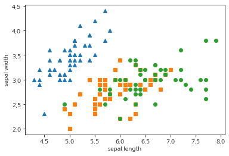
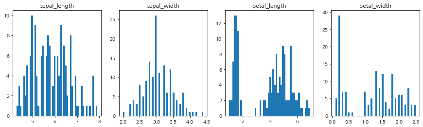
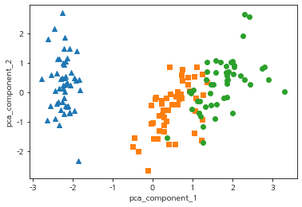
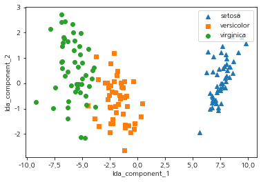
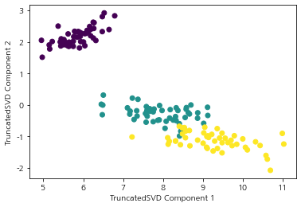
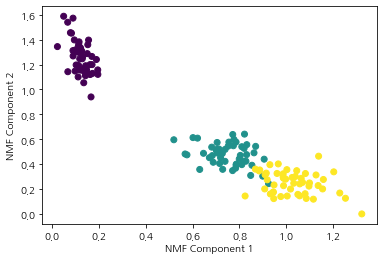

# 차원 축소(Dimension Rduction)
매우 많은 피처로 구성된 다차원 데이터 세트의 차원을 축소해 새로운 차원의 데이터 세트를 생성하는 것  
일반적으로 고차원으로 갈 수록, 데이터 포인트 간의 거리가 기하급수적으러 멀어지고 희소(sparse)한 구조를 가지게 됨  
단순히 피처의 개수를 줄이는 개념보다는, 데이터를 더 잘 설명할 수있는 잠재적인 요소를 추출하는데 의미  


- 피처 선택(Feature Selection) : 종속성이 강한 불필요한 피처는 제거하고, 데이터의 특징을 잘 나타내는 일부만 선택
- 피처 추출(Feature Extraction): 기존 피처를 저차원의 중요 피처로 압축해 추출

## PCA (Principal Componet Analysis)
주성분 분석은 가장 대표적인 차원 축소 기법  
여러 변수 간에 존재하는 상관관계를 이용해, 이를 대표하는 **주성분(Principal Component)** 을 추출해 차원을 축소하는 방법  
-> 가장 높은 분산을 가지는 데이터의 축을 찾아 이 축으로 차원을 축소  
- 가장 큰 데이터 변동성(Variance)을 기반으로 첫 번째 벡터 축 생성
- 이 축에 직각인 두 번째 벡터 축 생성
- 이전 축에 직각인 벡터 축을 생성
- 생성된 벡터 축에 원본 데이터를 투영하여 차원 축소

#### 선형 대수적 관점
- 입력 데이터의 공분산 행렬(Covariance Matrix)을 고유값(eigen value) 분해
- 고유 벡터(eigen vector)를 선형 변환

### PCA 절차
1. 입력 데이터의 공분산 행렬 생성
2. 공분산 행렬의 고유벡터와 고유값 계산
3. 고유값이 큰 순으로 K개(PCA 변환 차수)만큼 고유벡터 추출
4. 추출된 고유벡터를, 고유값이 큰 순으로 이용해 새로운 데이터로 변환


```python
from sklearn.datasets import load_iris
import pandas as pd
import matplotlib.pyplot as plt
import koreanize_matplotlib

iris = load_iris()
columns = ["sepal_length", "sepal_width", "petal_length", "petal_width"]
irisDF = pd.DataFrame(iris.data, columns=columns)
irisDF["target"] = iris.target

irisDF.sample(3)
```


<div>
<style scoped>
    .dataframe tbody tr th:only-of-type {
        vertical-align: middle;
    }

    .dataframe tbody tr th {
        vertical-align: top;
    }

    .dataframe thead th {
        text-align: right;
    }
</style>
<table border="1" class="dataframe">
  <thead>
    <tr style="text-align: right;">
      <th></th>
      <th>sepal_length</th>
      <th>sepal_width</th>
      <th>petal_length</th>
      <th>petal_width</th>
      <th>target</th>
    </tr>
  </thead>
  <tbody>
    <tr>
      <th>22</th>
      <td>4.6</td>
      <td>3.6</td>
      <td>1.0</td>
      <td>0.2</td>
      <td>0</td>
    </tr>
    <tr>
      <th>1</th>
      <td>4.9</td>
      <td>3.0</td>
      <td>1.4</td>
      <td>0.2</td>
      <td>0</td>
    </tr>
    <tr>
      <th>23</th>
      <td>5.1</td>
      <td>3.3</td>
      <td>1.7</td>
      <td>0.5</td>
      <td>0</td>
    </tr>
  </tbody>
</table>
</div>


```python
markers = ["^", "s", "o"]

for i, marker in enumerate(markers):
    x_axis_data = irisDF.loc[irisDF["target"]==i, "sepal_length"]
    y_axis_data = irisDF.loc[irisDF["target"]==i, "sepal_width"]
    plt.scatter(x_axis_data, y_axis_data, marker=marker, label=iris.target_names[i])
plt.xlabel("sepal length")
plt.ylabel("sepal width")
plt.show()
```


    

    


```python
plt.figure(figsize=(15, 4))
for i, col in enumerate(columns):
    plt.subplot(1, 4, i+1)
    plt.hist(irisDF[col], bins=50)
    plt.title(col)
plt.show()
```


    

    


PCA를 적용하기 위해서는, 정규분포에 가깝게 만들어야함 -> 스케일링이 필요


```python
from sklearn.preprocessing import StandardScaler

iris_scaled = StandardScaler().fit_transform(irisDF.iloc[:, :-1])
```


```python
from sklearn.decomposition import PCA

pca = PCA(n_components=2) # 4차원을 2차원으로 축소
pca.fit(iris_scaled)
iris_pca = pca.transform(iris_scaled)
print(iris_pca.shape)
```

    (150, 2)
    


```python
pca_columns = ["pca_component_1", "pca_component_2"]
irisDF_pca = pd.DataFrame(iris_pca, columns=pca_columns)
irisDF_pca["target"] = iris.target
irisDF_pca.sample(3)
```


<div>
<style scoped>
    .dataframe tbody tr th:only-of-type {
        vertical-align: middle;
    }

    .dataframe tbody tr th {
        vertical-align: top;
    }

    .dataframe thead th {
        text-align: right;
    }
</style>
<table border="1" class="dataframe">
  <thead>
    <tr style="text-align: right;">
      <th></th>
      <th>pca_component_1</th>
      <th>pca_component_2</th>
      <th>target</th>
    </tr>
  </thead>
  <tbody>
    <tr>
      <th>93</th>
      <td>-0.362183</td>
      <td>-2.019238</td>
      <td>1</td>
    </tr>
    <tr>
      <th>127</th>
      <td>1.020951</td>
      <td>0.064346</td>
      <td>2</td>
    </tr>
    <tr>
      <th>141</th>
      <td>1.901784</td>
      <td>0.689575</td>
      <td>2</td>
    </tr>
  </tbody>
</table>
</div>


```python
markers = ["^", "s", "o"]

for i, marker in enumerate(markers):
    x_axis_data = irisDF_pca.loc[irisDF_pca["target"]==i, "pca_component_1"]
    y_axis_data = irisDF_pca.loc[irisDF_pca["target"]==i, "pca_component_2"]
    plt.scatter(x_axis_data, y_axis_data, marker=marker, label=iris.target_names[i])
plt.xlabel("pca_component_1")
plt.ylabel("pca_component_2")
plt.show()
```


    

    


```python
# 전체 변동성에서 개별 PCA 요소별로 차지하는 변동성 비율
pca.explained_variance_ratio_
```


    array([0.72962445, 0.22850762])


## LDA (Linear Discriminant Analysis)
선형 판별 분석법으로 불리며, PCA와 유사  
LDA는 지도 학습의 분류에서 사용하기 쉽도록 개별 클래스를 분별할 수 있는 기준을 최대한 유지하면서 차원을 축소  
-> 입력 데이터의 결정 값 클래스를 최대한으로 분리할 수 있는 축을 찾음  


- 클래스 간 분산(between-class scatter)
- 클래스 내부 분산(within-class scatter)  
-> 클래스 간 분산은 최대한 크게 가져가고, 클래스 내부의 분산은 최대한 작게 가져가는 방식

### LDA 절차
1. 클래스 내부와 클래스 간 분산 행렬을 구함 (입력 데이터의 결정 값 클래스별 개별 피처의 평균 벡터 기반)
2. 고유값이 가장 큰 순으로 K개(LDA변환 차수) 추출
3. 추출된 고유벡터를 이용해 새로운 데이터로 변환


```python
from sklearn.discriminant_analysis import LinearDiscriminantAnalysis

iris = load_iris()
iris_scaled = StandardScaler().fit_transform(iris.data)

lda = LinearDiscriminantAnalysis(n_components=2)
lda.fit(iris_scaled, iris.target)
iris_lda = lda.transform(iris_scaled)
iris_lda.shape
```


    (150, 2)


```python
lda_columns = ["lda_component_1", "lda_component_2"]
irisDF_lda = pd.DataFrame(iris_lda, columns=lda_columns)
irisDF_lda["target"] = iris.target

for i, marker in enumerate(markers):
    x_axis_data = irisDF_lda.loc[irisDF_lda["target"]==i, "lda_component_1"]
    y_axis_data = irisDF_lda.loc[irisDF_lda["target"]==i, "lda_component_2"]
    plt.scatter(x_axis_data, y_axis_data, marker=marker, label=iris.target_names[i])
plt.legend(loc="upper right")
plt.xlabel("lda_component_1")
plt.ylabel("lda_component_2")
plt.show()
```


    

    


## SVD (Singular Value Decomposition)
특이값 분해라고 불리며, PCA와 유사한 행렬 분해 기법  
PCA는 정방 행렬만을 고유벡터로 분해할 수 있지만, SVD는 m*n 크기의 행렬도 분해 가능  
$A=U \sum V^T$
- A: m*n 크기의 행렬
- U, V: 특이벡터(singular vector)를 가진 행렬, 모든 특이벡터는 서로 직교
- $\sum$: 대각 행렬, 행렬 A의 특이값
- (m, n) = (m, m)\*(m, n)\*(n, n)


```python
import numpy as np
from numpy.linalg import svd
# 행렬의 개별 로우끼리 의존성을 없애기 위함
a = np.random.randn(4, 4)
np.round(a, 3)
```


    array([[-0.584, -0.56 ,  1.641, -0.239],
           [ 1.771,  1.434, -1.759,  0.84 ],
           [-0.323, -0.279,  0.186, -0.826],
           [-1.075,  1.415,  0.698,  0.566]])


```python
U, Sigma, Vt = svd(a)
print(U.shape, Sigma.shape, Vt.shape)
print(f"U matrix: \n{np.round(U, 3)}")
print(f"Sigma Value: \n{np.round(Sigma, 3)}")
print(f"V transpose matrix: \n{np.round(Vt, 3)}")
```

    (4, 4) (4,) (4, 4)
    U matrix: 
    [[-0.492  0.077  0.726  0.474]
     [ 0.845  0.126  0.27   0.443]
     [-0.18  -0.18  -0.599  0.759]
     [-0.104  0.973 -0.203  0.045]]
    Sigma Value: 
    [3.516 2.006 0.799 0.492]
    V transpose matrix: 
    [[ 0.556  0.396 -0.683  0.261]
     [-0.403  0.78   0.274  0.392]
     [ 0.583 -0.175  0.58   0.542]
     [ 0.434  0.452  0.35  -0.696]]
    


```python
# Sigma를 다시 0을 포함한 대칭행렬로 변환
Sigma_mat = np.diag(Sigma)
a_ = np.dot(np.dot(U, Sigma_mat), Vt)
np.round(a_, 3)
```


    array([[-0.584, -0.56 ,  1.641, -0.239],
           [ 1.771,  1.434, -1.759,  0.84 ],
           [-0.323, -0.279,  0.186, -0.826],
           [-1.075,  1.415,  0.698,  0.566]])


### Truncated SVD
특이값 중 상위 일부 데이터만 추출해 분해하는 방식


```python
from scipy.sparse.linalg import svds
from scipy.linalg import svd

matrix = np.random.random((6, 6))
print(f"원본 행렬:\n{np.round(matrix, 3)}")
print("--------------------------------------------------")
# SVD
U, Sigma, Vt = svd(matrix, full_matrices=False)
print(f"분해 행렬 차원: {U.shape, Sigma.shape, Vt.shape}")
print(f"Sigma:\n{np.round(Sigma, 3)}")
# Trucated SVD
print("--------------------------------------------------")
Utr, Sigmatr, Vttr = svds(matrix, k=4)
print(f"Truncated SVD 분해 행렬 차원: {Utr.shape, Sigmatr.shape, Vttr.shape}")
print(f"Sigmatr:\n{np.round(Sigmatr, 3)}")
matrix_tr = np.dot(np.dot(Utr, np.diag(Sigmatr)), Vttr)
print(f"복원후:\n{np.round(matrix_tr, 3)}")
```

    원본 행렬:
    [[0.144 0.193 0.189 0.585 0.728 0.001]
     [0.449 0.014 0.848 0.369 0.85  0.167]
     [0.484 0.969 0.259 0.121 0.484 0.404]
     [0.037 0.051 0.639 0.974 0.889 0.055]
     [0.729 0.927 0.962 0.371 0.923 0.968]
     [0.155 0.783 0.847 0.64  0.556 0.416]]
    --------------------------------------------------
    분해 행렬 차원: ((6, 6), (6,), (6, 6))
    Sigma:
    [3.268 1.29  0.653 0.493 0.243 0.021]
    --------------------------------------------------
    Truncated SVD 분해 행렬 차원: ((6, 4), (4,), (4, 6))
    Sigmatr:
    [0.493 0.653 1.29  3.268]
    복원후:
    [[ 0.157  0.201  0.199  0.584  0.72  -0.023]
     [ 0.433 -0.028  0.796  0.404  0.855  0.272]
     [ 0.466  0.938  0.22   0.143  0.492  0.484]
     [ 0.036  0.071  0.663  0.953  0.892  0.007]
     [ 0.748  0.974  1.02   0.334  0.917  0.851]
     [ 0.149  0.756  0.814  0.665  0.557  0.482]]
    

Truncated SVD 사용시 근사적으로 복원됨  
`sklearn`의 Truncated SVD는 분해한 행렬을 반환하지 않음


```python
from sklearn.decomposition import TruncatedSVD

iris = load_iris()
iris_ftrs = iris.data
tsvd = TruncatedSVD(n_components=2)
tsvd.fit(iris_ftrs)
iris_tsvd = tsvd.transform(iris_ftrs)

plt.scatter(x=iris_tsvd[:, 0], y=iris_tsvd[:, 1], c=iris.target)
plt.xlabel("TruncatedSVD Component 1")
plt.ylabel("TruncatedSVD Component 2")
plt.show()
```


    

    


## NMF (Non-Negative Matrix Factorization)
`Truncated SVD`와 같이 낮은 랭크를 통한 행렬 근사(Low-Rank Approximation) 방식의 변형  
원본 행렬 내의 모든 원소 값이 모두 양수라는게 보장되면, 두 개의 기반 양수 행렬로 분해될 수 있는 기법


```python
from sklearn.decomposition import NMF

iris = load_iris()
iris_ftrs = iris.data
nmf = NMF(n_components=2, init=None, max_iter=100000)
nmf.fit(iris_ftrs)
iris_nmf = nmf.transform(iris_ftrs)
plt.scatter(x=iris_nmf[:, 0], y=iris_nmf[:, 1], c=iris.target)
plt.xlabel("NMF Component 1")
plt.ylabel("NMF Component 2")
plt.show()
```


    

    

